# Kanix Commerce Platform -- Data Model

This document is the authoritative reference for every persistent entity in the Kanix Commerce Platform. It covers field definitions, types, constraints, state machines, cross-entity invariants, and index recommendations.

**Conventions**

| Convention | Meaning |
|---|---|
| `_minor` suffix | Monetary amount stored as integer minor units (cents for USD) |
| `_json` suffix | JSONB column |
| `_at` suffix | `timestamptz` |
| All PKs | `UUID` generated server-side (prefixed in API responses, e.g. `ord_`, `cus_`) |
| `created_at` / `updated_at` | Set by application; `updated_at` defaults to `created_at` on insert |
| `status` columns | Enforced via `CHECK` constraint against the documented enum values |
| Soft deletes | Not used. Entities use `status = archived` where applicable. |

---

## 1. Entity-Relationship Diagram

```mermaid
erDiagram

    %% ── Identity & Admin ──────────────────────────────────
    admin_user ||--o{ admin_user_role : "has"
    admin_role ||--o{ admin_user_role : "has"
    admin_user ||--o{ admin_audit_log : "performs"

    %% ── Customer ──────────────────────────────────────────
    customer ||--o{ customer_address : "has"
    customer ||--o{ order : "places"
    customer ||--o{ support_ticket : "opens"
    customer ||--o{ cart : "owns"

    %% ── Contributor ───────────────────────────────────────
    contributor |o--o| customer : "optionally linked"
    contributor ||--o{ contributor_design : "authors"
    contributor ||--o{ contributor_royalty : "earns"
    contributor ||--o{ contributor_milestone : "reaches"
    contributor ||--o{ contributor_tax_document : "uploads"
    contributor ||--o{ contributor_payout : "receives"
    contributor ||--o{ contributor_donation : "donates"
    contributor_design }o--|| product : "designed"

    %% ── Catalog ───────────────────────────────────────────
    product ||--o{ product_variant : "has"
    product ||--o{ product_media : "has"
    product }o--o{ collection : "belongs to"
    collection ||--o{ collection_product : "contains"
    product ||--o{ collection_product : "listed in"

    %% ── Product Classes & Kits ────────────────────────────
    product_class ||--o{ product_class_membership : "groups"
    product ||--o{ product_class_membership : "classified as"
    kit_definition ||--o{ kit_class_requirement : "requires"
    product_class ||--o{ kit_class_requirement : "satisfies"

    %% ── Inventory ─────────────────────────────────────────
    inventory_location ||--o{ inventory_balance : "tracks"
    product_variant ||--o{ inventory_balance : "stocked at"
    product_variant ||--o{ inventory_reservation : "reserved"
    product_variant ||--o{ inventory_adjustment : "adjusted"
    product_variant ||--o{ inventory_movement : "moved"

    %% ── Cart ──────────────────────────────────────────────
    cart ||--o{ cart_line : "contains"
    cart_line }o--|| product_variant : "references"
    cart_line ||--o{ cart_kit_selection : "kit picks"

    %% ── Order ─────────────────────────────────────────────
    order ||--o{ order_line : "contains"
    order ||--o{ payment : "paid by"
    order ||--o{ shipment : "shipped via"
    order ||--o{ fulfillment_task : "fulfilled by"
    order ||--o{ order_status_history : "history"
    order ||--o{ inventory_reservation : "reserves"
    order ||--o{ order_policy_acknowledgment : "acknowledged"
    order_line }o--|| product_variant : "snapshots"
    order_line ||--o{ contributor_royalty : "generates"

    %% ── Payment & Disputes ────────────────────────────────
    payment ||--o{ payment_event : "logs"
    payment ||--o{ refund : "refunded by"
    payment |o--o| dispute : "disputed"

    %% ── Shipping ──────────────────────────────────────────
    shipment ||--o{ shipment_package : "packaged in"
    shipment ||--o{ shipment_line : "ships"
    shipment ||--o{ shipment_event : "tracked"
    shipment |o--o| shipping_label_purchase : "label"
    shipment_line }o--|| order_line : "maps"

    %% ── Support ───────────────────────────────────────────
    support_ticket ||--o{ support_ticket_message : "thread"
    support_ticket ||--o{ support_ticket_attachment : "files"
    support_ticket ||--o{ support_ticket_status_history : "history"

    %% ── Evidence & Policy ─────────────────────────────────
    order ||--o{ evidence_record : "evidence"
    payment ||--o{ evidence_record : "evidence"
    shipment ||--o{ evidence_record : "evidence"
    support_ticket ||--o{ evidence_record : "evidence"
    dispute ||--o{ evidence_record : "evidence"
    dispute ||--o{ evidence_bundle : "bundled"
    policy_snapshot ||--o{ order_policy_acknowledgment : "acknowledged in"
```



---

## 2. Entity Field Tables

### 2.A Identity and Admin

#### `admin_user`

| Column | Type | Nullable | Default | Constraints | Description |
|---|---|---|---|---|---|
| `id` | `uuid` | NO | `gen_random_uuid()` | PK | |
| `auth_subject` | `text` | NO | | UNIQUE | SuperTokens subject identifier |
| `email` | `text` | NO | | UNIQUE | |
| `name` | `text` | NO | | | Display name |
| `status` | `text` | NO | `'active'` | CHECK (`active`, `suspended`, `deactivated`) | |
| `created_at` | `timestamptz` | NO | `now()` | | |
| `updated_at` | `timestamptz` | NO | `now()` | | |

#### `admin_role`

| Column | Type | Nullable | Default | Constraints | Description |
|---|---|---|---|---|---|
| `id` | `uuid` | NO | `gen_random_uuid()` | PK | |
| `name` | `text` | NO | | UNIQUE | Machine-readable name (e.g. `support_agent`) |
| `description` | `text` | YES | | | Human-readable description |

#### `admin_user_role`

| Column | Type | Nullable | Default | Constraints | Description |
|---|---|---|---|---|---|
| `admin_user_id` | `uuid` | NO | | FK -> `admin_user.id`, PK component | |
| `admin_role_id` | `uuid` | NO | | FK -> `admin_role.id`, PK component | |

Primary key: `(admin_user_id, admin_role_id)`

#### `admin_audit_log`

Immutable. No UPDATE or DELETE.

| Column | Type | Nullable | Default | Constraints | Description |
|---|---|---|---|---|---|
| `id` | `uuid` | NO | `gen_random_uuid()` | PK | |
| `actor_admin_user_id` | `uuid` | NO | | FK -> `admin_user.id` | Who performed the action |
| `action` | `text` | NO | | | Machine-readable action (e.g. `order.cancel`, `inventory.adjust`) |
| `entity_type` | `text` | NO | | | Target entity table name |
| `entity_id` | `uuid` | NO | | | Target entity PK |
| `before_json` | `jsonb` | YES | | | Snapshot of entity state before change |
| `after_json` | `jsonb` | YES | | | Snapshot of entity state after change |
| `ip_address` | `inet` | YES | | | Request IP |
| `created_at` | `timestamptz` | NO | `now()` | | |

---

### 2.B Customer Identity

#### `customer`

| Column | Type | Nullable | Default | Constraints | Description |
|---|---|---|---|---|---|
| `id` | `uuid` | NO | `gen_random_uuid()` | PK | |
| `auth_subject` | `text` | NO | | UNIQUE | SuperTokens subject identifier |
| `email` | `text` | NO | | UNIQUE | |
| `first_name` | `text` | YES | | | |
| `last_name` | `text` | YES | | | |
| `phone` | `text` | YES | | | E.164 format |
| `status` | `text` | NO | `'active'` | CHECK (`active`, `suspended`, `banned`) | |
| `created_at` | `timestamptz` | NO | `now()` | | |
| `updated_at` | `timestamptz` | NO | `now()` | | |

#### `customer_address`

US-only for v1.

| Column | Type | Nullable | Default | Constraints | Description |
|---|---|---|---|---|---|
| `id` | `uuid` | NO | `gen_random_uuid()` | PK | |
| `customer_id` | `uuid` | NO | | FK -> `customer.id` | |
| `type` | `text` | NO | | CHECK (`shipping`, `billing`) | |
| `full_name` | `text` | NO | | | Recipient name |
| `phone` | `text` | YES | | | |
| `line1` | `text` | NO | | | |
| `line2` | `text` | YES | | | |
| `city` | `text` | NO | | | |
| `state` | `text` | NO | | | US state code |
| `postal_code` | `text` | NO | | | |
| `country` | `text` | NO | `'US'` | CHECK (`US`) | US-only for v1 |
| `is_default` | `boolean` | NO | `false` | | Only one default per customer per type |
| `created_at` | `timestamptz` | NO | `now()` | | |

---

### 2.C Catalog

#### `product`

| Column | Type | Nullable | Default | Constraints | Description |
|---|---|---|---|---|---|
| `id` | `uuid` | NO | `gen_random_uuid()` | PK | |
| `slug` | `text` | NO | | UNIQUE | URL-safe identifier |
| `title` | `text` | NO | | | |
| `subtitle` | `text` | YES | | | |
| `description` | `text` | YES | | | Rich text / markdown |
| `status` | `text` | NO | `'draft'` | CHECK (`draft`, `active`, `archived`) | See state machine 6.G |
| `brand` | `text` | YES | | | |
| `created_at` | `timestamptz` | NO | `now()` | | |
| `updated_at` | `timestamptz` | NO | `now()` | | |

#### `product_variant`

Material variant axis only (TPU / PA11 / TPC). No color axis for v1.

| Column | Type | Nullable | Default | Constraints | Description |
|---|---|---|---|---|---|
| `id` | `uuid` | NO | `gen_random_uuid()` | PK | |
| `product_id` | `uuid` | NO | | FK -> `product.id` | |
| `sku` | `text` | NO | | UNIQUE | |
| `title` | `text` | NO | | | Human-readable variant name |
| `option_values_json` | `jsonb` | NO | `'{}'` | | e.g. `{"material": "TPU"}` |
| `price_minor` | `integer` | NO | | CHECK (> 0) | Price in minor units (cents). Products cannot be free. |
| `currency` | `text` | NO | `'USD'` | CHECK (`USD`) | |
| `weight` | `numeric(10,4)` | YES | | | Weight in kg |
| `dimensions_json` | `jsonb` | YES | | | `{"length": N, "width": N, "height": N, "unit": "in"}` |
| `barcode` | `text` | YES | | | UPC / EAN |
| `status` | `text` | NO | `'draft'` | CHECK (`draft`, `active`, `inactive`, `archived`) | See state machine 6.G |
| `created_at` | `timestamptz` | NO | `now()` | | |
| `updated_at` | `timestamptz` | NO | `now()` | | |

#### `product_media`

| Column | Type | Nullable | Default | Constraints | Description |
|---|---|---|---|---|---|
| `id` | `uuid` | NO | `gen_random_uuid()` | PK | |
| `product_id` | `uuid` | NO | | FK -> `product.id` | |
| `variant_id` | `uuid` | YES | | FK -> `product_variant.id` | Null = product-level media |
| `url` | `text` | NO | | | Storage URL or CDN path |
| `alt_text` | `text` | YES | | | Accessibility text |
| `sort_order` | `integer` | NO | `0` | | Display ordering |

#### `collection`

| Column | Type | Nullable | Default | Constraints | Description |
|---|---|---|---|---|---|
| `id` | `uuid` | NO | `gen_random_uuid()` | PK | |
| `slug` | `text` | NO | | UNIQUE | |
| `title` | `text` | NO | | | |
| `description` | `text` | YES | | | |
| `status` | `text` | NO | `'draft'` | CHECK (`draft`, `active`, `archived`) | |

#### `collection_product`

| Column | Type | Nullable | Default | Constraints | Description |
|---|---|---|---|---|---|
| `collection_id` | `uuid` | NO | | FK -> `collection.id`, PK component | |
| `product_id` | `uuid` | NO | | FK -> `product.id`, PK component | |
| `sort_order` | `integer` | NO | `0` | | |

Primary key: `(collection_id, product_id)`

---

### 2.D Product Classes and Kit Definitions

#### `product_class`

Classification axis for kit composition. A product class groups products that are interchangeable within a kit slot (e.g. "keycap set", "switch plate").

| Column | Type | Nullable | Default | Constraints | Description |
|---|---|---|---|---|---|
| `id` | `uuid` | NO | `gen_random_uuid()` | PK | |
| `name` | `text` | NO | | UNIQUE | Human-readable name |
| `slug` | `text` | NO | | UNIQUE | URL-safe identifier |
| `description` | `text` | YES | | | |
| `sort_order` | `integer` | NO | `0` | | Display ordering |

#### `product_class_membership`

Which products belong to which class. A product may belong to multiple classes.

| Column | Type | Nullable | Default | Constraints | Description |
|---|---|---|---|---|---|
| `product_id` | `uuid` | NO | | FK -> `product.id`, PK component | |
| `product_class_id` | `uuid` | NO | | FK -> `product_class.id`, PK component | |

Primary key: `(product_id, product_class_id)`

#### `kit_definition`

A purchasable kit template. Defines what classes (and how many from each) compose the kit.

| Column | Type | Nullable | Default | Constraints | Description |
|---|---|---|---|---|---|
| `id` | `uuid` | NO | `gen_random_uuid()` | PK | |
| `slug` | `text` | NO | | UNIQUE | |
| `title` | `text` | NO | | | |
| `description` | `text` | YES | | | |
| `price_minor` | `integer` | NO | | CHECK (>= 0) | Kit price in minor units |
| `currency` | `text` | NO | `'USD'` | CHECK (`USD`) | |
| `status` | `text` | NO | `'draft'` | CHECK (`draft`, `active`, `archived`) | |

#### `kit_class_requirement`

"This kit needs N items from this product class."

| Column | Type | Nullable | Default | Constraints | Description |
|---|---|---|---|---|---|
| `kit_definition_id` | `uuid` | NO | | FK -> `kit_definition.id`, PK component | |
| `product_class_id` | `uuid` | NO | | FK -> `product_class.id`, PK component | |
| `quantity` | `integer` | NO | | CHECK (>= 1) | Number of items required from this class |

Primary key: `(kit_definition_id, product_class_id)`

#### `cart_kit_selection`

Tracks which specific variant the customer selected for each class requirement within a kit line item.

| Column | Type | Nullable | Default | Constraints | Description |
|---|---|---|---|---|---|
| `cart_line_id` | `uuid` | NO | | FK -> `cart_line.id` | The cart line representing this kit purchase |
| `kit_definition_id` | `uuid` | NO | | FK -> `kit_definition.id` | |
| `variant_id` | `uuid` | NO | | FK -> `product_variant.id` | The specific variant chosen |
| `product_class_id` | `uuid` | NO | | FK -> `product_class.id` | Which class slot this selection fills |

Unique constraint: `(cart_line_id, kit_definition_id, product_class_id, variant_id)`

---

### 2.E Inventory

#### `inventory_location`

Single location for v1; schema supports multi-location for future expansion.

| Column | Type | Nullable | Default | Constraints | Description |
|---|---|---|---|---|---|
| `id` | `uuid` | NO | `gen_random_uuid()` | PK | |
| `name` | `text` | NO | | | |
| `code` | `text` | NO | | UNIQUE | Short machine-readable code |
| `type` | `text` | NO | | CHECK (`warehouse`, `store`, `dropship`) | |
| `address_json` | `jsonb` | YES | | | Location address |
| `is_active` | `boolean` | NO | `true` | | |

#### `inventory_balance`

Current stock state per variant per location. Mutable -- updated in-place.

| Column | Type | Nullable | Default | Constraints | Description |
|---|---|---|---|---|---|
| `id` | `uuid` | NO | `gen_random_uuid()` | PK | |
| `variant_id` | `uuid` | NO | | FK -> `product_variant.id` | |
| `location_id` | `uuid` | NO | | FK -> `inventory_location.id` | |
| `on_hand` | `integer` | NO | `0` | CHECK (>= 0) | Physical count |
| `reserved` | `integer` | NO | `0` | CHECK (>= 0) | Held for active orders/carts |
| `available` | `integer` | NO | `0` | CHECK (>= 0) | `on_hand - reserved` (maintained by application) |
| `safety_stock` | `integer` | NO | `0` | CHECK (>= 0) | Threshold for low-stock alerts |
| `updated_at` | `timestamptz` | NO | `now()` | | |

Unique constraint: `(variant_id, location_id)`

Invariant: `available = on_hand - reserved` must hold at all times.

#### `inventory_reservation`

Temporary or order-linked stock hold. See state machine 6.B.

| Column | Type | Nullable | Default | Constraints | Description |
|---|---|---|---|---|---|
| `id` | `uuid` | NO | `gen_random_uuid()` | PK | |
| `order_id` | `uuid` | YES | | FK -> `order.id` | Set when reservation converts to order |
| `cart_id` | `uuid` | YES | | FK -> `cart.id` | Set during checkout |
| `variant_id` | `uuid` | NO | | FK -> `product_variant.id` | |
| `location_id` | `uuid` | NO | | FK -> `inventory_location.id` | |
| `quantity` | `integer` | NO | | CHECK (>= 1) | |
| `status` | `text` | NO | `'pending'` | CHECK (`pending`, `active`, `consumed`, `released`, `expired`, `canceled`) | See state machine 6.B |
| `reservation_reason` | `text` | NO | | | e.g. `checkout`, `admin_hold` |
| `expires_at` | `timestamptz` | YES | | | TTL for automatic expiry |
| `created_at` | `timestamptz` | NO | `now()` | | |
| `released_at` | `timestamptz` | YES | | | When released/expired/consumed |

#### `inventory_adjustment`

Human or system initiated stock adjustment. Immutable record.

| Column | Type | Nullable | Default | Constraints | Description |
|---|---|---|---|---|---|
| `id` | `uuid` | NO | `gen_random_uuid()` | PK | |
| `idempotency_key` | `text` | YES | | UNIQUE | Optional. If provided, duplicate requests with same key return original result. |
| `variant_id` | `uuid` | NO | | FK -> `product_variant.id` | |
| `location_id` | `uuid` | NO | | FK -> `inventory_location.id` | |
| `adjustment_type` | `text` | NO | | CHECK (`restock`, `shrinkage`, `correction`, `damage`, `return`) | |
| `quantity_delta` | `integer` | NO | | | Positive = add, negative = remove |
| `reason` | `text` | NO | | | Machine-readable reason |
| `notes` | `text` | YES | | | Free-text notes (e.g. PO number) |
| `actor_admin_user_id` | `uuid` | YES | | FK -> `admin_user.id` | Null for system-initiated |
| `related_order_id` | `uuid` | YES | | FK -> `order.id` | If adjustment is order-related |
| `created_at` | `timestamptz` | NO | `now()` | | |

#### `inventory_movement`

Immutable stock movement ledger. No UPDATE or DELETE. This is the source-of-truth audit trail.

| Column | Type | Nullable | Default | Constraints | Description |
|---|---|---|---|---|---|
| `id` | `uuid` | NO | `gen_random_uuid()` | PK | |
| `variant_id` | `uuid` | NO | | FK -> `product_variant.id` | |
| `location_id` | `uuid` | NO | | FK -> `inventory_location.id` | |
| `movement_type` | `text` | NO | | CHECK (`reservation`, `consumption`, `release`, `adjustment`, `return`) | |
| `quantity_delta` | `integer` | NO | | | Signed delta |
| `reference_type` | `text` | NO | | | Source entity type (e.g. `inventory_reservation`, `inventory_adjustment`) |
| `reference_id` | `uuid` | NO | | | Source entity PK |
| `created_at` | `timestamptz` | NO | `now()` | | |

---

### 2.F Cart and Order Lifecycle

#### `cart`

| Column | Type | Nullable | Default | Constraints | Description |
|---|---|---|---|---|---|
| `id` | `uuid` | NO | `gen_random_uuid()` | PK | |
| `token` | `uuid` | NO | `gen_random_uuid()` | UNIQUE | Opaque cart token for guest carts. Used as `X-Cart-Token` header. Distinct from `id` for security (don't expose PK). |
| `customer_id` | `uuid` | YES | | FK -> `customer.id` | Null for anonymous/guest carts |
| `status` | `text` | NO | `'active'` | CHECK (`active`, `converted`, `abandoned`, `expired`) | |
| `currency` | `text` | NO | `'USD'` | CHECK (`USD`) | |
| `expires_at` | `timestamptz` | YES | | | Cart-level TTL |
| `created_at` | `timestamptz` | NO | `now()` | | |
| `updated_at` | `timestamptz` | NO | `now()` | | |

#### `cart_line`

| Column | Type | Nullable | Default | Constraints | Description |
|---|---|---|---|---|---|
| `id` | `uuid` | NO | `gen_random_uuid()` | PK | |
| `cart_id` | `uuid` | NO | | FK -> `cart.id` | |
| `variant_id` | `uuid` | NO | | FK -> `product_variant.id` | |
| `quantity` | `integer` | NO | | CHECK (>= 1) | |
| `unit_price_minor` | `integer` | NO | | CHECK (>= 0) | Price at time of add |
| `created_at` | `timestamptz` | NO | `now()` | | |

#### `order`

Order-level monetary fields are snapshots computed at placement time.

| Column | Type | Nullable | Default | Constraints | Description |
|---|---|---|---|---|---|
| `id` | `uuid` | NO | `gen_random_uuid()` | PK | |
| `order_number` | `text` | NO | | UNIQUE | Human-readable sequential number (KNX-000001) |
| `customer_id` | `uuid` | YES | | FK -> `customer.id` | Null for guest checkout |
| `email` | `text` | NO | | | Customer email — used for guest order linking on account creation. Indexed for lookup. |
| `status` | `text` | NO | `'draft'` | CHECK (`draft`, `pending_payment`, `confirmed`, `completed`, `canceled`, `closed`) | See state machine 6.A.1 |
| `payment_status` | `text` | NO | `'unpaid'` | CHECK (`unpaid`, `processing`, `paid`, `partially_refunded`, `refunded`, `failed`, `disputed`) | See state machine 6.A.2 |
| `fulfillment_status` | `text` | NO | `'unfulfilled'` | CHECK (`unfulfilled`, `queued`, `picking`, `packing`, `ready_to_ship`, `partially_fulfilled`, `fulfilled`, `canceled`) | See state machine 6.A.3 |
| `shipping_status` | `text` | NO | `'not_shipped'` | CHECK (`not_shipped`, `label_pending`, `label_purchased`, `shipped`, `in_transit`, `out_for_delivery`, `delivered`, `delivery_exception`, `returned`, `canceled`) | See state machine 6.A.4 |
| `currency` | `text` | NO | `'USD'` | CHECK (`USD`) | |
| `subtotal_minor` | `integer` | NO | | CHECK (>= 0) | Sum of line totals |
| `tax_minor` | `integer` | NO | `0` | CHECK (>= 0) | |
| `shipping_minor` | `integer` | NO | `0` | CHECK (>= 0) | |
| `discount_minor` | `integer` | NO | `0` | CHECK (>= 0) | |
| `total_minor` | `integer` | NO | | CHECK (>= 0) | `subtotal + tax + shipping - discount` |
| `billing_address_snapshot_json` | `jsonb` | YES | | | Frozen at placement time |
| `shipping_address_snapshot_json` | `jsonb` | YES | | | Frozen at placement time |
| `placed_at` | `timestamptz` | YES | | | When order transitioned from draft |
| `created_at` | `timestamptz` | NO | `now()` | | |
| `updated_at` | `timestamptz` | NO | `now()` | | |

#### `order_line`

Snapshots of the purchased item at placement time. Never updated after creation.

| Column | Type | Nullable | Default | Constraints | Description |
|---|---|---|---|---|---|
| `id` | `uuid` | NO | `gen_random_uuid()` | PK | |
| `order_id` | `uuid` | NO | | FK -> `order.id` | |
| `variant_id` | `uuid` | NO | | FK -> `product_variant.id` | Reference for analytics; snapshot fields are authoritative |
| `sku_snapshot` | `text` | NO | | | SKU at time of purchase |
| `title_snapshot` | `text` | NO | | | Product + variant title at time of purchase |
| `option_values_snapshot_json` | `jsonb` | NO | `'{}'` | | e.g. `{"material": "TPU"}` |
| `quantity` | `integer` | NO | | CHECK (>= 1) | |
| `unit_price_minor` | `integer` | NO | | CHECK (>= 0) | |
| `total_minor` | `integer` | NO | | CHECK (>= 0) | `quantity * unit_price_minor` |

#### `order_status_history`

Immutable log of all status transitions across the four order state machines.

| Column | Type | Nullable | Default | Constraints | Description |
|---|---|---|---|---|---|
| `id` | `uuid` | NO | `gen_random_uuid()` | PK | |
| `order_id` | `uuid` | NO | | FK -> `order.id` | |
| `status_type` | `text` | NO | | CHECK (`status`, `payment_status`, `fulfillment_status`, `shipping_status`) | Which state machine changed |
| `old_value` | `text` | NO | | | Previous state |
| `new_value` | `text` | NO | | | New state |
| `reason` | `text` | YES | | | |
| `actor_admin_user_id` | `uuid` | YES | | FK -> `admin_user.id` | Null for system/webhook transitions |
| `created_at` | `timestamptz` | NO | `now()` | | |

---

### 2.G Payments and Disputes

#### `payment`

| Column | Type | Nullable | Default | Constraints | Description |
|---|---|---|---|---|---|
| `id` | `uuid` | NO | `gen_random_uuid()` | PK | |
| `order_id` | `uuid` | NO | | FK -> `order.id` | |
| `provider` | `text` | NO | `'stripe'` | CHECK (`stripe`) | |
| `provider_payment_intent_id` | `text` | NO | | UNIQUE | Stripe PaymentIntent ID |
| `provider_charge_id` | `text` | YES | | | Stripe Charge ID (set on success) |
| `status` | `text` | NO | `'pending'` | CHECK (`pending`, `processing`, `succeeded`, `failed`, `canceled`) | |
| `amount_minor` | `integer` | NO | | CHECK (>= 0) | |
| `currency` | `text` | NO | `'USD'` | CHECK (`USD`) | |
| `payment_method_type` | `text` | YES | | | e.g. `card`, `us_bank_account` |
| `created_at` | `timestamptz` | NO | `now()` | | |
| `updated_at` | `timestamptz` | NO | `now()` | | |

#### `payment_event`

Immutable. Raw Stripe webhook events.

| Column | Type | Nullable | Default | Constraints | Description |
|---|---|---|---|---|---|
| `id` | `uuid` | NO | `gen_random_uuid()` | PK | |
| `payment_id` | `uuid` | NO | | FK -> `payment.id` | |
| `provider_event_id` | `text` | NO | | UNIQUE | Stripe event ID (idempotency key) |
| `event_type` | `text` | NO | | | e.g. `payment_intent.succeeded` |
| `payload_json` | `jsonb` | NO | | | Raw webhook payload |
| `created_at` | `timestamptz` | NO | `now()` | | |

#### `refund`

| Column | Type | Nullable | Default | Constraints | Description |
|---|---|---|---|---|---|
| `id` | `uuid` | NO | `gen_random_uuid()` | PK | |
| `order_id` | `uuid` | NO | | FK -> `order.id` | |
| `payment_id` | `uuid` | NO | | FK -> `payment.id` | |
| `provider_refund_id` | `text` | YES | | | Stripe Refund ID |
| `amount_minor` | `integer` | NO | | CHECK (> 0) | |
| `reason` | `text` | NO | | | e.g. `damaged_item`, `customer_request` |
| `status` | `text` | NO | `'pending'` | CHECK (`pending`, `processing`, `succeeded`, `failed`) | |
| `actor_admin_user_id` | `uuid` | YES | | FK -> `admin_user.id` | |
| `created_at` | `timestamptz` | NO | `now()` | | |

#### `dispute`

| Column | Type | Nullable | Default | Constraints | Description |
|---|---|---|---|---|---|
| `id` | `uuid` | NO | `gen_random_uuid()` | PK | |
| `payment_id` | `uuid` | NO | | FK -> `payment.id` | |
| `order_id` | `uuid` | NO | | FK -> `order.id` | |
| `provider_dispute_id` | `text` | NO | | UNIQUE | Stripe Dispute ID |
| `reason` | `text` | YES | | | Stripe dispute reason code |
| `amount_minor` | `integer` | NO | | CHECK (>= 0) | |
| `currency` | `text` | NO | `'USD'` | CHECK (`USD`) | |
| `status` | `text` | NO | `'opened'` | CHECK (`opened`, `evidence_gathering`, `ready_to_submit`, `submitted`, `won`, `lost`, `accepted`, `closed`) | See state machine 6.F |
| `due_by` | `timestamptz` | YES | | | Stripe evidence deadline |
| `opened_at` | `timestamptz` | NO | | | |
| `closed_at` | `timestamptz` | YES | | | |

---

### 2.H Shipping and Fulfillment

#### `fulfillment_task`

| Column | Type | Nullable | Default | Constraints | Description |
|---|---|---|---|---|---|
| `id` | `uuid` | NO | `gen_random_uuid()` | PK | |
| `order_id` | `uuid` | NO | | FK -> `order.id` | |
| `status` | `text` | NO | `'new'` | CHECK (`new`, `assigned`, `picking`, `picked`, `packing`, `packed`, `shipment_pending`, `done`, `blocked`, `canceled`) | See state machine 6.D |
| `priority` | `text` | NO | `'normal'` | CHECK (`low`, `normal`, `high`, `urgent`) | |
| `assigned_admin_user_id` | `uuid` | YES | | FK -> `admin_user.id` | |
| `picking_status` | `text` | YES | | | Sub-status for picking workflow |
| `packing_status` | `text` | YES | | | Sub-status for packing workflow |
| `notes` | `text` | YES | | | |
| `created_at` | `timestamptz` | NO | `now()` | | |
| `updated_at` | `timestamptz` | NO | `now()` | | |

#### `shipment`

| Column | Type | Nullable | Default | Constraints | Description |
|---|---|---|---|---|---|
| `id` | `uuid` | NO | `gen_random_uuid()` | PK | |
| `order_id` | `uuid` | NO | | FK -> `order.id` | |
| `shipment_number` | `text` | NO | | UNIQUE | Human-readable identifier |
| `status` | `text` | NO | `'draft'` | CHECK (`draft`, `label_pending`, `label_purchased`, `ready`, `shipped`, `in_transit`, `delivered`, `exception`, `returned`, `voided`) | See state machine 6.E |
| `carrier` | `text` | YES | | | e.g. `ups`, `usps`, `fedex` |
| `service_level` | `text` | YES | | | e.g. `ground`, `priority` |
| `shipping_provider` | `text` | YES | | | Label/rate API provider |
| `tracking_number` | `text` | YES | | | |
| `tracking_url` | `text` | YES | | | |
| `label_url` | `text` | YES | | | Shipping label file URL |
| `label_purchased_at` | `timestamptz` | YES | | | |
| `shipped_at` | `timestamptz` | YES | | | |
| `delivered_at` | `timestamptz` | YES | | | |
| `created_at` | `timestamptz` | NO | `now()` | | |
| `updated_at` | `timestamptz` | NO | `now()` | | |

#### `shipment_package`

| Column | Type | Nullable | Default | Constraints | Description |
|---|---|---|---|---|---|
| `id` | `uuid` | NO | `gen_random_uuid()` | PK | |
| `shipment_id` | `uuid` | NO | | FK -> `shipment.id` | |
| `weight` | `numeric(10,4)` | YES | | | Weight in kg |
| `dimensions_json` | `jsonb` | YES | | | `{"length": N, "width": N, "height": N, "unit": "in"}` |
| `package_type` | `text` | YES | | | e.g. `box`, `poly_mailer`, `tube` |
| `label_url` | `text` | YES | | | Per-package label if multi-piece |

#### `shipment_line`

Maps order lines into a shipment. Supports partial shipments.

| Column | Type | Nullable | Default | Constraints | Description |
|---|---|---|---|---|---|
| `id` | `uuid` | NO | `gen_random_uuid()` | PK | |
| `shipment_id` | `uuid` | NO | | FK -> `shipment.id` | |
| `order_line_id` | `uuid` | NO | | FK -> `order_line.id` | |
| `quantity` | `integer` | NO | | CHECK (>= 1) | Quantity of this line in this shipment |

#### `shipment_event`

Carrier tracking timeline. Immutable.

| Column | Type | Nullable | Default | Constraints | Description |
|---|---|---|---|---|---|
| `id` | `uuid` | NO | `gen_random_uuid()` | PK | |
| `shipment_id` | `uuid` | NO | | FK -> `shipment.id` | |
| `provider_event_id` | `text` | YES | | | Carrier-assigned event ID |
| `status` | `text` | NO | | | Carrier status code |
| `description` | `text` | YES | | | Human-readable event description |
| `occurred_at` | `timestamptz` | NO | | | When the carrier event happened |
| `raw_payload_json` | `jsonb` | YES | | | Raw carrier webhook/poll payload |

#### `shipping_label_purchase`

| Column | Type | Nullable | Default | Constraints | Description |
|---|---|---|---|---|---|
| `id` | `uuid` | NO | `gen_random_uuid()` | PK | |
| `shipment_id` | `uuid` | NO | | FK -> `shipment.id`, UNIQUE | One label purchase per shipment |
| `provider_label_id` | `text` | NO | | | Provider-assigned label ID |
| `cost_minor` | `integer` | NO | | CHECK (>= 0) | Label cost in minor units |
| `currency` | `text` | NO | `'USD'` | CHECK (`USD`) | |
| `purchased_at` | `timestamptz` | NO | | | |
| `raw_payload_json` | `jsonb` | YES | | | Raw provider response |

---

### 2.I Support

#### `support_ticket`

| Column | Type | Nullable | Default | Constraints | Description |
|---|---|---|---|---|---|
| `id` | `uuid` | NO | `gen_random_uuid()` | PK | |
| `ticket_number` | `text` | NO | | UNIQUE | Human-readable identifier |
| `customer_id` | `uuid` | YES | | FK -> `customer.id` | |
| `order_id` | `uuid` | YES | | FK -> `order.id` | |
| `shipment_id` | `uuid` | YES | | FK -> `shipment.id` | |
| `subject` | `text` | NO | | | |
| `category` | `text` | NO | | | e.g. `shipping_issue`, `product_question`, `billing` |
| `priority` | `text` | NO | `'normal'` | CHECK (`low`, `normal`, `high`, `urgent`) | |
| `status` | `text` | NO | `'open'` | CHECK (`open`, `waiting_on_customer`, `waiting_on_internal`, `resolved`, `closed`, `spam`) | See state machine 6.C |
| `source` | `text` | NO | | | e.g. `customer_app`, `admin_created`, `email` |
| `created_at` | `timestamptz` | NO | `now()` | | |
| `updated_at` | `timestamptz` | NO | `now()` | | |
| `resolved_at` | `timestamptz` | YES | | | |

#### `support_ticket_message`

| Column | Type | Nullable | Default | Constraints | Description |
|---|---|---|---|---|---|
| `id` | `uuid` | NO | `gen_random_uuid()` | PK | |
| `ticket_id` | `uuid` | NO | | FK -> `support_ticket.id` | |
| `author_type` | `text` | NO | | CHECK (`customer`, `admin`, `system`) | |
| `customer_id` | `uuid` | YES | | FK -> `customer.id` | Set when `author_type = customer` |
| `admin_user_id` | `uuid` | YES | | FK -> `admin_user.id` | Set when `author_type = admin` |
| `body` | `text` | NO | | | Message content |
| `is_internal_note` | `boolean` | NO | `false` | | Internal notes are never shown to customers |
| `created_at` | `timestamptz` | NO | `now()` | | |

#### `support_ticket_attachment`

| Column | Type | Nullable | Default | Constraints | Description |
|---|---|---|---|---|---|
| `id` | `uuid` | NO | `gen_random_uuid()` | PK | |
| `ticket_id` | `uuid` | NO | | FK -> `support_ticket.id` | |
| `message_id` | `uuid` | YES | | FK -> `support_ticket_message.id` | Null if attached to ticket directly |
| `storage_key` | `text` | NO | | | Object storage key |
| `file_name` | `text` | NO | | | Original file name |
| `content_type` | `text` | NO | | | MIME type |
| `size_bytes` | `integer` | NO | | CHECK (> 0) | |
| `created_at` | `timestamptz` | NO | `now()` | | |

#### `support_ticket_status_history`

| Column | Type | Nullable | Default | Constraints | Description |
|---|---|---|---|---|---|
| `id` | `uuid` | NO | `gen_random_uuid()` | PK | |
| `ticket_id` | `uuid` | NO | | FK -> `support_ticket.id` | |
| `old_status` | `text` | NO | | | |
| `new_status` | `text` | NO | | | |
| `actor_admin_user_id` | `uuid` | YES | | FK -> `admin_user.id` | |
| `created_at` | `timestamptz` | NO | `now()` | | |

---

### 2.J Evidence and Policy

#### `evidence_record`

Immutable. No UPDATE or DELETE.

| Column | Type | Nullable | Default | Constraints | Description |
|---|---|---|---|---|---|
| `id` | `uuid` | NO | `gen_random_uuid()` | PK | |
| `order_id` | `uuid` | YES | | FK -> `order.id` | |
| `payment_id` | `uuid` | YES | | FK -> `payment.id` | |
| `shipment_id` | `uuid` | YES | | FK -> `shipment.id` | |
| `dispute_id` | `uuid` | YES | | FK -> `dispute.id` | |
| `support_ticket_id` | `uuid` | YES | | FK -> `support_ticket.id` | |
| `type` | `text` | NO | | CHECK (`delivery_proof`, `tracking_history`, `customer_communication`, `policy_acceptance`, `payment_receipt`) | Canonical evidence types |
| `storage_key` | `text` | YES | | | Object storage key for file-based evidence |
| `text_content` | `text` | YES | | | Inline text evidence |
| `metadata_json` | `jsonb` | YES | | | Arbitrary metadata |
| `created_at` | `timestamptz` | NO | `now()` | | |

Constraint: At least one of `storage_key` or `text_content` must be non-null.

#### `evidence_bundle`

Generated evidence packet for dispute submission.

| Column | Type | Nullable | Default | Constraints | Description |
|---|---|---|---|---|---|
| `id` | `uuid` | NO | `gen_random_uuid()` | PK | |
| `dispute_id` | `uuid` | NO | | FK -> `dispute.id` | |
| `status` | `text` | NO | `'generating'` | CHECK (`generating`, `generated`, `submitted`, `failed`) | |
| `generated_at` | `timestamptz` | YES | | | |
| `storage_key` | `text` | YES | | | Object storage key for the bundle file |
| `metadata_json` | `jsonb` | YES | | | Bundle contents manifest |

#### `policy_snapshot`

Versioned copy of policy text. Immutable once created.

| Column | Type | Nullable | Default | Constraints | Description |
|---|---|---|---|---|---|
| `id` | `uuid` | NO | `gen_random_uuid()` | PK | |
| `policy_type` | `text` | NO | | | e.g. `terms_of_service`, `refund_policy`, `shipping_policy`, `privacy_policy` |
| `version` | `integer` | NO | | | Monotonically increasing per `policy_type` |
| `content_html` | `text` | NO | | | HTML rendering |
| `content_text` | `text` | NO | | | Plain text rendering |
| `effective_at` | `timestamptz` | NO | | | When this version becomes active |

Unique constraint: `(policy_type, version)`

#### `order_policy_acknowledgment`

Captures customer agreement to policies at order time.

| Column | Type | Nullable | Default | Constraints | Description |
|---|---|---|---|---|---|
| `id` | `uuid` | NO | `gen_random_uuid()` | PK | |
| `order_id` | `uuid` | NO | | FK -> `order.id` | |
| `policy_snapshot_id` | `uuid` | NO | | FK -> `policy_snapshot.id` | |
| `acknowledged_at` | `timestamptz` | NO | | | |
| `context_json` | `jsonb` | YES | | | e.g. IP address, user agent, checkout page URL |

---

### 2.K Contributor Program

#### `contributor`

Represents an external designer who contributes product designs.

| Column | Type | Nullable | Default | Constraints | Description |
|---|---|---|---|---|---|
| `id` | `uuid` | NO | `gen_random_uuid()` | PK | |
| `github_username` | `text` | NO | | UNIQUE | |
| `github_user_id` | `text` | NO | | UNIQUE | Numeric GitHub user ID stored as text |
| `customer_id` | `uuid` | YES | | FK -> `customer.id`, UNIQUE | Linked when contributor creates a customer account |
| `cla_accepted_at` | `timestamptz` | YES | | | When contributor accepted the CLA |
| `status` | `text` | NO | `'pending'` | CHECK (`pending`, `active`, `suspended`, `deactivated`) | |

#### `contributor_design`

Links a contributor to the product they designed.

| Column | Type | Nullable | Default | Constraints | Description |
|---|---|---|---|---|---|
| `id` | `uuid` | NO | `gen_random_uuid()` | PK | |
| `contributor_id` | `uuid` | NO | | FK -> `contributor.id` | |
| `product_id` | `uuid` | NO | | FK -> `product.id` | |
| `created_at` | `timestamptz` | NO | `now()` | | |

Unique constraint: `(contributor_id, product_id)`

#### `contributor_royalty`

Per-order-line royalty accrual for contributors.

| Column | Type | Nullable | Default | Constraints | Description |
|---|---|---|---|---|---|
| `id` | `uuid` | NO | `gen_random_uuid()` | PK | |
| `contributor_id` | `uuid` | NO | | FK -> `contributor.id` | |
| `order_line_id` | `uuid` | NO | | FK -> `order_line.id`, UNIQUE | One royalty record per order line per contributor |
| `amount_minor` | `integer` | NO | | CHECK (>= 0) | Royalty amount in minor units |
| `currency` | `text` | NO | `'USD'` | CHECK (`USD`) | |
| `status` | `text` | NO | `'accrued'` | CHECK (`accrued`, `paid`, `clawed_back`) | |
| `created_at` | `timestamptz` | NO | `now()` | | |

#### `contributor_milestone`

Tracks contributor lifecycle milestones.

| Column | Type | Nullable | Default | Constraints | Description |
|---|---|---|---|---|---|
| `id` | `uuid` | NO | `gen_random_uuid()` | PK | |
| `contributor_id` | `uuid` | NO | | FK -> `contributor.id` | |
| `milestone_type` | `text` | NO | | CHECK (`accepted_pr`, `royalty_activation`, `starter_kit`) | |
| `reached_at` | `timestamptz` | NO | | | When the milestone was achieved |
| `fulfilled_at` | `timestamptz` | YES | | | When any associated reward was fulfilled |
| `notes` | `text` | YES | | | |

#### `contributor_tax_document`

Tax form storage for royalty payouts (W-9, W-8BEN).

| Column | Type | Nullable | Default | Constraints | Description |
|---|---|---|---|---|---|
| `id` | `uuid` | NO | `gen_random_uuid()` | PK | |
| `contributor_id` | `uuid` | NO | | FK -> `contributor.id` | |
| `document_type` | `text` | NO | | CHECK (`w9`, `w8ben`) | |
| `storage_key` | `text` | NO | | | Object storage key for the encrypted document |
| `uploaded_at` | `timestamptz` | NO | | | |
| `status` | `text` | NO | `'pending_review'` | CHECK (`pending_review`, `approved`, `rejected`) | |

#### `contributor_payout`

Records of royalty disbursements to contributors.

| Column | Type | Nullable | Default | Constraints | Description |
|---|---|---|---|---|---|
| `id` | `uuid` | NO | `gen_random_uuid()` | PK | |
| `contributor_id` | `uuid` | NO | | FK -> `contributor.id` | |
| `amount_minor` | `integer` | NO | | CHECK (> 0) | |
| `currency` | `text` | NO | `'USD'` | CHECK (`USD`) | |
| `payout_method` | `text` | NO | | | e.g. `stripe_transfer`, `check`, `paypal` |
| `status` | `text` | NO | `'pending'` | CHECK (`pending`, `processing`, `completed`, `failed`) | |
| `initiated_at` | `timestamptz` | NO | | | |
| `completed_at` | `timestamptz` | YES | | | |

#### `contributor_donation`

Contributor-directed charitable donations from royalties.

| Column | Type | Nullable | Default | Constraints | Description |
|---|---|---|---|---|---|
| `id` | `uuid` | NO | `gen_random_uuid()` | PK | |
| `contributor_id` | `uuid` | NO | | FK -> `contributor.id` | |
| `charity_name` | `text` | NO | | | |
| `charity_ein` | `text` | NO | | | IRS Employer Identification Number |
| `amount_minor` | `integer` | NO | | CHECK (> 0) | |
| `currency` | `text` | NO | `'USD'` | CHECK (`USD`) | |
| `status` | `text` | NO | `'pending'` | CHECK (`pending`, `processing`, `completed`, `failed`) | |
| `created_at` | `timestamptz` | NO | `now()` | | |

---

## 3. State Machine Definitions

Each state machine below lists every valid state and the legal transitions between them. Transitions not listed are illegal and must be rejected by the application layer.

### 6.A Order State Machines

The order entity carries four orthogonal state machines. They advance independently but have cross-machine guards documented in section 4.

#### 6.A.1 `order.status` -- Business Lifecycle

```
draft --> pending_payment --> confirmed --> completed --> closed
                |                |
                v                v
            canceled         canceled (only if not shipped)
```

| From | To | Trigger | Guard |
|---|---|---|---|
| `draft` | `pending_payment` | Checkout initiated | |
| `pending_payment` | `confirmed` | Payment succeeded | `payment_status = paid` |
| `pending_payment` | `canceled` | Payment failed / customer cancels | |
| `confirmed` | `completed` | All lines fulfilled and delivered | `fulfillment_status = fulfilled` AND `shipping_status = delivered` |
| `confirmed` | `canceled` | Admin cancellation | `shipping_status` must not be `shipped`, `in_transit`, `delivered` |
| `completed` | `closed` | Admin closes / retention period elapsed | |

#### 6.A.2 `order.payment_status`

```
unpaid --> processing --> paid --> partially_refunded --> refunded
              |            |
              v            +--> refunded
           failed          +--> disputed --> paid (won)
                                         \-> refunded (lost)
```

| From | To | Trigger |
|---|---|---|
| `unpaid` | `processing` | Checkout initiated / Stripe PaymentIntent created |
| `processing` | `paid` | Stripe `payment_intent.succeeded` webhook |
| `processing` | `failed` | Stripe `payment_intent.payment_failed` webhook |
| `paid` | `partially_refunded` | Partial refund processed |
| `paid` | `refunded` | Full refund processed |
| `paid` | `disputed` | Stripe `charge.dispute.created` webhook |
| `partially_refunded` | `refunded` | Remaining balance refunded |
| `disputed` | `paid` | Dispute won (`charge.dispute.closed` with `status=won`) |
| `disputed` | `refunded` | Dispute lost |

#### 6.A.3 `order.fulfillment_status`

```
unfulfilled --> queued --> picking --> packing --> ready_to_ship --> fulfilled
                                                       |
                                              partially_fulfilled
    (any pre-ship state) --> canceled
```

| From | To | Trigger | Guard |
|---|---|---|---|
| `unfulfilled` | `queued` | Fulfillment task created | `payment_status = paid` (unless pre-payment pick is enabled) |
| `queued` | `picking` | Picker begins pick | |
| `picking` | `packing` | All items picked | |
| `packing` | `ready_to_ship` | All items packed | |
| `ready_to_ship` | `fulfilled` | All shipments created and shipped | |
| any active | `partially_fulfilled` | Partial line split / partial shipment | |
| pre-shipment | `canceled` | Order canceled | |

#### 6.A.4 `order.shipping_status`

```
not_shipped --> label_pending --> label_purchased --> shipped --> in_transit
    --> out_for_delivery --> delivered
                                |
                        delivery_exception
                                |
                            returned

    (pre-ship states) --> canceled
```

| From | To | Trigger |
|---|---|---|
| `not_shipped` | `label_pending` | Shipment draft created |
| `label_pending` | `label_purchased` | Label purchased from carrier |
| `label_purchased` | `shipped` | Package scanned / marked shipped |
| `shipped` | `in_transit` | Carrier tracking update |
| `in_transit` | `out_for_delivery` | Carrier tracking update |
| `out_for_delivery` | `delivered` | Carrier delivery confirmation |
| `in_transit` / `out_for_delivery` | `delivery_exception` | Carrier exception event |
| `delivered` | `returned` | Return initiated / carrier return scan |
| pre-ship states | `canceled` | Shipment voided |

---

### 6.B `inventory_reservation.status`

```
pending --> active --> consumed
               |
               +--> released
               +--> expired

pending --> canceled
```

| From | To | Trigger | Side Effect |
|---|---|---|---|
| `pending` | `active` | Reservation confirmed | Atomically increment `inventory_balance.reserved`, decrement `available` |
| `active` | `consumed` | Payment confirmed, stock committed | Decrement `on_hand` and `reserved`; `available` unchanged |
| `active` | `released` | Admin release / cart abandoned | Decrement `reserved`, increment `available` |
| `active` | `expired` | TTL expired (background job) | Decrement `reserved`, increment `available` |
| `pending` | `canceled` | Checkout abandoned before activation | No balance change |

---

### 6.C `support_ticket.status`

```
open --> waiting_on_customer --> open
open --> waiting_on_internal --> open
open --> resolved --> closed
open --> spam

resolved --> open (reopen)
```

| From | To | Trigger |
|---|---|---|
| `open` | `waiting_on_customer` | Admin replies, awaiting customer response |
| `open` | `waiting_on_internal` | Escalated / needs internal investigation |
| `waiting_on_customer` | `open` | Customer replies |
| `waiting_on_internal` | `open` | Internal action completed |
| `open` | `resolved` | Issue resolved |
| `resolved` | `closed` | Closure after resolution period |
| `resolved` | `open` | Customer reopens |
| `open` | `spam` | Marked as spam |

---

### 6.D `fulfillment_task.status`

```
new --> assigned --> picking --> picked --> packing --> packed
    --> shipment_pending --> done

(any active state) --> blocked
(pre-shipment states) --> canceled
```

| From | To | Trigger |
|---|---|---|
| `new` | `assigned` | Admin assigned |
| `assigned` | `picking` | Picker starts |
| `picking` | `picked` | All items scanned/confirmed |
| `picked` | `packing` | Packer starts |
| `packing` | `packed` | All items packed |
| `packed` | `shipment_pending` | Awaiting shipment creation/label |
| `shipment_pending` | `done` | Shipment created and handed off |
| any active | `blocked` | Inventory issue / exception |
| pre-shipment | `canceled` | Order canceled |

---

### 6.E `shipment.status`

```
draft --> label_pending --> label_purchased --> ready --> shipped
    --> in_transit --> delivered
                  \-> exception --> in_transit (recovery)

delivered --> returned
(pre-ship) --> voided
```

| From | To | Trigger |
|---|---|---|
| `draft` | `label_pending` | Shipment submitted for label |
| `label_pending` | `label_purchased` | Label purchase succeeded |
| `label_purchased` | `ready` | Label printed / ready for pickup |
| `ready` | `shipped` | Package scanned by carrier |
| `shipped` | `in_transit` | Carrier in-transit scan |
| `in_transit` | `delivered` | Carrier delivery confirmation |
| `in_transit` | `exception` | Carrier exception event |
| `exception` | `in_transit` | Exception resolved, back in transit |
| `delivered` | `returned` | Return initiated |
| pre-ship states | `voided` | Label voided / shipment canceled |

---

### 6.F `dispute.status`

```
opened --> evidence_gathering --> ready_to_submit --> submitted --> won --> closed
                                                              \-> lost --> closed
opened --> accepted --> closed
```

| From | To | Trigger |
|---|---|---|
| `opened` | `evidence_gathering` | Admin begins evidence collection |
| `evidence_gathering` | `ready_to_submit` | Evidence bundle marked complete |
| `ready_to_submit` | `submitted` | Evidence submitted to Stripe |
| `opened` | `accepted` | Admin accepts the dispute (no contest) |
| `submitted` | `won` | Stripe `charge.dispute.closed` with `status=won` |
| `submitted` | `lost` | Stripe `charge.dispute.closed` with `status=lost` |
| `accepted` | `closed` | Terminal |
| `won` | `closed` | Terminal |
| `lost` | `closed` | Terminal |

---

### 6.G Product and Variant Status

#### `product.status`

| From | To | Guard |
|---|---|---|
| `draft` | `active` | At least one variant with `status = active` |
| `active` | `draft` | Admin unpublishes |
| `active` | `archived` | Terminal for display; existing orders unaffected |
| `draft` | `archived` | Terminal |

#### `product_variant.status`

| From | To | Guard |
|---|---|---|
| `draft` | `active` | SKU and price set |
| `active` | `inactive` | Temporarily unavailable |
| `inactive` | `active` | Re-enabled |
| `active` | `archived` | Terminal |
| `inactive` | `archived` | Terminal |
| `draft` | `archived` | Terminal |

#### `kit_definition.status`

| From | To | Guard |
|---|---|---|
| `draft` | `active` | At least one `kit_class_requirement` exists; all referenced product classes have active products |
| `active` | `draft` | Admin unpublishes |
| `active` | `archived` | Terminal |
| `draft` | `archived` | Terminal |

---

### 6.H Contributor Royalty Status

#### `contributor_royalty.status`

| From | To | Trigger |
|---|---|---|
| `accrued` | `paid` | Included in a completed `contributor_payout` |
| `accrued` | `clawed_back` | Order refunded / disputed-and-lost |

#### `contributor_tax_document.status`

| From | To | Trigger |
|---|---|---|
| `pending_review` | `approved` | Admin review |
| `pending_review` | `rejected` | Admin review |

#### `contributor_payout.status`

| From | To | Trigger |
|---|---|---|
| `pending` | `processing` | Payout initiated |
| `processing` | `completed` | Transfer confirmed |
| `processing` | `failed` | Transfer failed |

#### `contributor_donation.status`

| From | To | Trigger |
|---|---|---|
| `pending` | `processing` | Donation initiated |
| `processing` | `completed` | Donation confirmed |
| `processing` | `failed` | Donation failed |

---

## 4. Cross-Entity Constraints and Invariants

### 4.1 Inventory Integrity

| # | Invariant | Enforcement |
|---|---|---|
| INV-1 | `inventory_balance.available = on_hand - reserved` at all times | Application-level atomic update; CHECK constraint as safety net |
| INV-2 | `available` must never go negative | CHECK (`available >= 0`) + `SELECT ... FOR UPDATE` on balance row during reservation |
| INV-3 | `inventory_movement` rows are append-only | Revoke UPDATE/DELETE at the database level |
| INV-4 | Sum of active reservation quantities for a (variant, location) must equal `inventory_balance.reserved` | Reconciliation job; application maintains on each transition |
| INV-5 | `inventory_adjustment` rows are append-only | Revoke UPDATE/DELETE at the database level |

### 4.2 Order Snapshot Integrity

| # | Invariant | Enforcement |
|---|---|---|
| ORD-1 | `order_line.sku_snapshot`, `title_snapshot`, `option_values_snapshot_json`, and `unit_price_minor` must not change after order placement | Application-level; no UPDATE on `order_line` after `order.status` leaves `draft` |
| ORD-2 | `order.billing_address_snapshot_json` and `shipping_address_snapshot_json` are frozen at placement | Same as ORD-1 |
| ORD-3 | `order.total_minor = subtotal_minor + tax_minor + shipping_minor - discount_minor` | Application-level computed on placement; CHECK constraint optional |
| ORD-4 | `order_line.total_minor = quantity * unit_price_minor` | Application-level; CHECK constraint optional |

### 4.3 Shipment Line Coverage

| # | Invariant | Enforcement |
|---|---|---|
| SHP-1 | Sum of `shipment_line.quantity` across all shipments for an order line must not exceed `order_line.quantity` | Application-level check on shipment creation |
| SHP-2 | `order.fulfillment_status = fulfilled` only when all order lines are fully covered by shipment lines in non-voided shipments | Application-level state transition guard |

### 4.4 Payment and Refund Integrity

| # | Invariant | Enforcement |
|---|---|---|
| PAY-1 | Sum of `refund.amount_minor` for a payment must not exceed `payment.amount_minor` | Application-level check; database trigger optional |
| PAY-2 | `payment_event.provider_event_id` is unique (idempotency) | UNIQUE constraint |
| PAY-3 | An order's `payment_status` cannot become `paid` unless at least one `payment` with `status = succeeded` exists | State transition guard |

### 4.5 Dispute and Evidence Integrity

| # | Invariant | Enforcement |
|---|---|---|
| DIS-1 | `evidence_record` rows are append-only (immutable) | Revoke UPDATE/DELETE at database level |
| DIS-2 | `evidence_bundle` can only be generated when `dispute.status` is `evidence_gathering` or `ready_to_submit` | Application-level guard |
| DIS-3 | A dispute cannot move to `ready_to_submit` unless at least one `evidence_record` is linked | Application-level guard |

### 4.6 Customer Address

| # | Invariant | Enforcement |
|---|---|---|
| ADDR-1 | At most one `is_default = true` per (customer_id, type) | Partial unique index: `UNIQUE (customer_id, type) WHERE is_default = true` |
| ADDR-2 | `country = 'US'` for v1 | CHECK constraint |

### 4.7 Kit Composition

| # | Invariant | Enforcement |
|---|---|---|
| KIT-1 | A `cart_kit_selection` entry must reference a `variant_id` whose product belongs to the referenced `product_class_id` (via `product_class_membership`) | Application-level check on cart mutation |
| KIT-2 | The number of `cart_kit_selection` rows for a (cart_line, kit_definition, product_class) must not exceed the `quantity` in the corresponding `kit_class_requirement` | Application-level check |
| KIT-3 | `kit_definition` cannot become `active` unless it has at least one `kit_class_requirement` | State transition guard |

### 4.8 Contributor Program

| # | Invariant | Enforcement |
|---|---|---|
| CTR-1 | `contributor.customer_id` is nullable but UNIQUE when set (one contributor per customer) | UNIQUE constraint with NULL exclusion |
| CTR-2 | `contributor_royalty` can only be `clawed_back` if the associated order was refunded or the dispute was lost | Application-level guard |
| CTR-3 | `contributor_payout` can only be created when the contributor has an approved `contributor_tax_document` | Application-level guard |
| CTR-4 | `contributor_royalty.order_line_id` is UNIQUE -- one royalty per order line per contributor | UNIQUE constraint |

---

## 5. Index Recommendations

Indexes are grouped by access pattern. Primary keys and UNIQUE constraints create implicit indexes and are not repeated.

### 5.1 Admin and Auth

```sql
-- Fast lookup by auth subject during session validation
CREATE INDEX idx_admin_user_auth_subject ON admin_user (auth_subject);
CREATE INDEX idx_customer_auth_subject ON customer (auth_subject);

-- Audit log queries filtered by entity
CREATE INDEX idx_audit_log_entity ON admin_audit_log (entity_type, entity_id);
CREATE INDEX idx_audit_log_actor ON admin_audit_log (actor_admin_user_id, created_at DESC);
```

### 5.2 Catalog

```sql
-- Product listing filtered by status
CREATE INDEX idx_product_status ON product (status) WHERE status = 'active';

-- Variant lookup by product
CREATE INDEX idx_variant_product ON product_variant (product_id);
CREATE INDEX idx_variant_sku ON product_variant (sku);

-- Media ordering
CREATE INDEX idx_media_product_sort ON product_media (product_id, sort_order);

-- Collection membership
CREATE INDEX idx_collection_product_sort ON collection_product (collection_id, sort_order);

-- Product class membership lookups (both directions)
CREATE INDEX idx_pcm_product ON product_class_membership (product_id);
CREATE INDEX idx_pcm_class ON product_class_membership (product_class_id);

-- Kit requirements by kit
CREATE INDEX idx_kit_req_kit ON kit_class_requirement (kit_definition_id);
```

### 5.3 Inventory

```sql
-- Balance lookup by variant (the primary query path)
CREATE INDEX idx_balance_variant ON inventory_balance (variant_id);

-- Low stock alert query
CREATE INDEX idx_balance_low_stock ON inventory_balance (variant_id, location_id)
    WHERE available <= safety_stock;

-- Active reservations for expiry sweeper
CREATE INDEX idx_reservation_active_expires ON inventory_reservation (expires_at)
    WHERE status = 'active';

-- Reservation by order/cart
CREATE INDEX idx_reservation_order ON inventory_reservation (order_id) WHERE order_id IS NOT NULL;
CREATE INDEX idx_reservation_cart ON inventory_reservation (cart_id) WHERE cart_id IS NOT NULL;

-- Movement ledger by variant for audit queries
CREATE INDEX idx_movement_variant ON inventory_movement (variant_id, created_at DESC);

-- Adjustment by variant
CREATE INDEX idx_adjustment_variant ON inventory_adjustment (variant_id, created_at DESC);
```

### 5.4 Cart

```sql
-- Cart by customer
CREATE INDEX idx_cart_customer ON cart (customer_id) WHERE customer_id IS NOT NULL;

-- Active carts for expiry sweeper
CREATE INDEX idx_cart_active_expires ON cart (expires_at) WHERE status = 'active';

-- Cart lines by cart
CREATE INDEX idx_cart_line_cart ON cart_line (cart_id);

-- Kit selections by cart line
CREATE INDEX idx_kit_selection_cart_line ON cart_kit_selection (cart_line_id);
```

### 5.5 Orders

```sql
-- Order listing with status filters (the admin's most common query)
CREATE INDEX idx_order_status ON "order" (status, placed_at DESC);
CREATE INDEX idx_order_payment_status ON "order" (payment_status) WHERE payment_status IN ('processing', 'disputed');
CREATE INDEX idx_order_fulfillment_status ON "order" (fulfillment_status) WHERE fulfillment_status NOT IN ('fulfilled', 'canceled');
CREATE INDEX idx_order_shipping_status ON "order" (shipping_status) WHERE shipping_status NOT IN ('delivered', 'canceled');

-- Orders by customer
CREATE INDEX idx_order_customer ON "order" (customer_id, placed_at DESC);

-- Order number lookup (human-readable search)
CREATE INDEX idx_order_number ON "order" (order_number);
CREATE INDEX idx_order_email ON "order" (email) WHERE customer_id IS NULL;

-- Order lines by order
CREATE INDEX idx_order_line_order ON order_line (order_id);

-- Status history by order
CREATE INDEX idx_order_status_history ON order_status_history (order_id, created_at DESC);
```

### 5.6 Payments and Disputes

```sql
-- Payment by order
CREATE INDEX idx_payment_order ON payment (order_id);

-- Payment events by payment
CREATE INDEX idx_payment_event_payment ON payment_event (payment_id, created_at DESC);

-- Refunds by order
CREATE INDEX idx_refund_order ON refund (order_id);

-- Disputes by status (admin queue)
CREATE INDEX idx_dispute_status ON dispute (status) WHERE status NOT IN ('closed');

-- Disputes by due date (urgent-first ordering)
CREATE INDEX idx_dispute_due_by ON dispute (due_by ASC) WHERE status IN ('opened', 'evidence_gathering', 'ready_to_submit');

-- Dispute by order
CREATE INDEX idx_dispute_order ON dispute (order_id);
```

### 5.7 Shipping and Fulfillment

```sql
-- Fulfillment tasks by status (queue view)
CREATE INDEX idx_fulfillment_task_status ON fulfillment_task (status, priority, created_at);

-- Fulfillment tasks by order
CREATE INDEX idx_fulfillment_task_order ON fulfillment_task (order_id);

-- Shipments by order
CREATE INDEX idx_shipment_order ON shipment (order_id);

-- Shipment lines by shipment
CREATE INDEX idx_shipment_line_shipment ON shipment_line (shipment_id);

-- Shipment lines by order line (coverage check)
CREATE INDEX idx_shipment_line_order_line ON shipment_line (order_line_id);

-- Shipment events by shipment
CREATE INDEX idx_shipment_event_shipment ON shipment_event (shipment_id, occurred_at DESC);
```

### 5.8 Support

```sql
-- Ticket queue (admin's primary view)
CREATE INDEX idx_ticket_status_priority ON support_ticket (status, priority, created_at DESC)
    WHERE status NOT IN ('closed', 'spam');

-- Tickets by customer
CREATE INDEX idx_ticket_customer ON support_ticket (customer_id) WHERE customer_id IS NOT NULL;

-- Tickets by order
CREATE INDEX idx_ticket_order ON support_ticket (order_id) WHERE order_id IS NOT NULL;

-- Messages by ticket
CREATE INDEX idx_ticket_message_ticket ON support_ticket_message (ticket_id, created_at);

-- Attachments by ticket
CREATE INDEX idx_ticket_attachment_ticket ON support_ticket_attachment (ticket_id);
```

### 5.9 Evidence and Policy

```sql
-- Evidence by dispute (bundle generation)
CREATE INDEX idx_evidence_dispute ON evidence_record (dispute_id) WHERE dispute_id IS NOT NULL;

-- Evidence by order
CREATE INDEX idx_evidence_order ON evidence_record (order_id) WHERE order_id IS NOT NULL;

-- Evidence by shipment
CREATE INDEX idx_evidence_shipment ON evidence_record (shipment_id) WHERE shipment_id IS NOT NULL;

-- Evidence by support ticket
CREATE INDEX idx_evidence_ticket ON evidence_record (support_ticket_id) WHERE support_ticket_id IS NOT NULL;

-- Evidence bundles by dispute
CREATE INDEX idx_evidence_bundle_dispute ON evidence_bundle (dispute_id);

-- Policy version lookup
CREATE INDEX idx_policy_type_effective ON policy_snapshot (policy_type, effective_at DESC);

-- Acknowledgments by order
CREATE INDEX idx_acknowledgment_order ON order_policy_acknowledgment (order_id);
```

### 5.10 Contributor Program

```sql
-- Contributor by GitHub identity
CREATE INDEX idx_contributor_github ON contributor (github_username);

-- Designs by contributor
CREATE INDEX idx_design_contributor ON contributor_design (contributor_id);

-- Designs by product (find the designer)
CREATE INDEX idx_design_product ON contributor_design (product_id);

-- Royalties by contributor (payout calculation)
CREATE INDEX idx_royalty_contributor_status ON contributor_royalty (contributor_id, status);

-- Royalties by order line
CREATE INDEX idx_royalty_order_line ON contributor_royalty (order_line_id);

-- Milestones by contributor
CREATE INDEX idx_milestone_contributor ON contributor_milestone (contributor_id);

-- Tax documents by contributor
CREATE INDEX idx_tax_doc_contributor ON contributor_tax_document (contributor_id);

-- Payouts by contributor
CREATE INDEX idx_payout_contributor ON contributor_payout (contributor_id, initiated_at DESC);

-- Donations by contributor
CREATE INDEX idx_donation_contributor ON contributor_donation (contributor_id, created_at DESC);
```

---

## 6. Entity Count Summary

| Domain | Entities | Count |
|---|---|---|
| Identity & Admin | `admin_user`, `admin_role`, `admin_user_role`, `admin_audit_log` | 4 |
| Customer | `customer`, `customer_address` | 2 |
| Catalog | `product`, `product_variant`, `product_media`, `collection`, `collection_product` | 5 |
| Product Classes & Kits | `product_class`, `product_class_membership`, `kit_definition`, `kit_class_requirement`, `cart_kit_selection` | 5 |
| Inventory | `inventory_location`, `inventory_balance`, `inventory_reservation`, `inventory_adjustment`, `inventory_movement` | 5 |
| Cart & Order | `cart`, `cart_line`, `order`, `order_line`, `order_status_history` | 5 |
| Payments & Disputes | `payment`, `payment_event`, `refund`, `dispute` | 4 |
| Shipping & Fulfillment | `fulfillment_task`, `shipment`, `shipment_package`, `shipment_line`, `shipment_event`, `shipping_label_purchase` | 6 |
| Support | `support_ticket`, `support_ticket_message`, `support_ticket_attachment`, `support_ticket_status_history` | 4 |
| Evidence & Policy | `evidence_record`, `evidence_bundle`, `policy_snapshot`, `order_policy_acknowledgment` | 4 |
| Contributor | `contributor`, `contributor_design`, `contributor_royalty`, `contributor_milestone`, `contributor_tax_document`, `contributor_payout`, `contributor_donation` | 7 |
| **Total** | | **51** |
