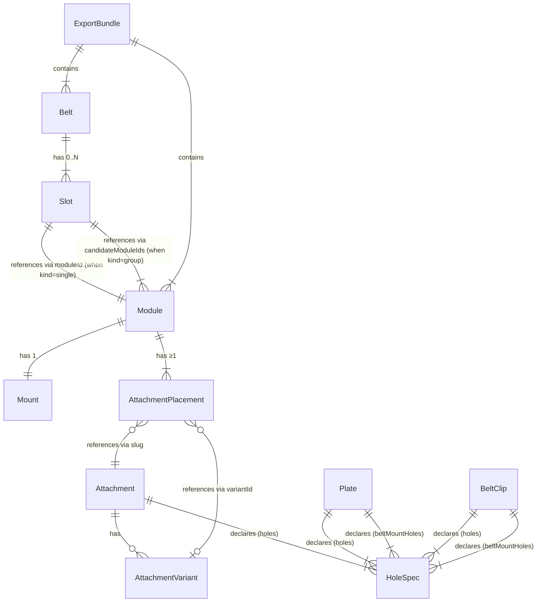

# Data Model: Belt Editor

This document is the system of record for the new TypeScript types
introduced by the belt-editor feature. It defines every entity, its
fields, its relationships, and how it migrates from the existing data
layer.

All types live in `site/src/lib/editor/types.ts` and are imported by
the data files (`attachments.ts`, `plates.ts`, `belt-clips.ts`,
`loadouts.ts`) and the editor UI.

---

## Entity overview



Notation: solid lines indicate ownership / strong reference; dashed
lines indicate registry lookup (the referenced entity lives in its own
registry, not embedded). `Mount` is a discriminated union of `Plate`
and `BeltClip`.

---

## Type catalog

### `HoleSpec`

A single bolt hole on a Mount or Attachment, extracted from a BOSL2
named anchor in the model's SCAD source.

```ts
interface HoleSpec {
  /**
   * Anchor name from the SCAD source. Convention:
   *   Mount bolt holes: `bolt_<col>_<row>` (1-indexed)
   *   Mount belt-mount holes: `belt_<n>` (1-indexed)
   *   Attachment bolt holes: `bolt_<n>` (1-indexed, in declaration order)
   * Acts as a stable identity across edits.
   */
  name: string;

  /** Position in millimeters, model-local frame. */
  x: number;
  y: number;
  z: number;

  /**
   * Outward normal (unit vector). For Kanix flat-plate holes this is
   * always [0, 0, 1] (Z+, away from belt). Kept for future
   * non-flat mounts.
   */
  normal: [number, number, number];

  /**
   * Bolt diameter spec, e.g. "M3", "M5". "unknown" if the SCAD
   * author didn't annotate; build warns and the hardware list
   * falls back to "× ?mm" per FR-702.
   */
  boltSize: string;
}
```

Producer: `scripts/extract-holes.sh` (IC-001).
Consumer: editor snap math (`snap.ts`), hardware list, plate/clip
rendering.

---

### `AttachmentVariant`

Sub-type of an Attachment, e.g. `carabiner-clip / tiny` vs
`carabiner-clip / small`. Each variant has its own STL and bolt-hole
pattern (extracted from its SCAD).

```ts
interface AttachmentVariant {
  /** Unique within the parent Attachment. */
  id: string;
  /** Display label e.g. "Tiny", "Small", "Strong". */
  label: string;
  /** STL filename relative to site/public/models/. */
  stlFile: string;
  /** Holes for THIS variant (each variant has its own SCAD + extract). */
  holes: HoleSpec[];
  /** Product links specific to this variant. */
  products?: Product[];
}
```

---

### `Attachment`

A single 3D-printed accessory. Replaces the existing `Module` type in
`modules.ts`. Authored in `site/src/data/attachments.ts`.

```ts
interface Attachment {
  /** Stable slug; used in URLs and as the lookup key. */
  slug: string;
  /** Display name. */
  name: string;
  /** Marketing one-liner. */
  description: string;
  /**
   * Category for palette grouping (FR-301).
   * One of: 'leash' | 'carabiner' | 'holster' | 'pouch' | 'light' |
   * 'clicker' | 'bag-mount' | 'other'
   */
  category: AttachmentCategory;
  /** Primary SCAD file (relative to repo root). */
  scadFile: string;
  /** Primary STL file (relative to site/public/models/). */
  stlFile: string;
  /**
   * Bolt holes extracted from the primary SCAD. Inlined at build
   * time from <model>.holes.json.
   */
  holes: HoleSpec[];
  /**
   * Variants of this attachment (e.g. sizes). If empty, the
   * attachment is a single-variant item.
   */
  variants?: AttachmentVariant[];
  /** Third-party Amazon products this attachment is designed for. */
  products: Product[];
  /** Marker for attachments that have no 3D body (e.g. heel lead). */
  noModel?: true;
}

type AttachmentCategory =
  | 'leash'
  | 'carabiner'
  | 'holster'
  | 'pouch'
  | 'light'
  | 'clicker'
  | 'bag-mount'
  | 'other';
```

Producer: `site/src/data/attachments.ts` (handwritten registry; build
step inlines holes).
Consumer: editor palette, snap math, BOM, print list, hardware list.

---

### `Plate` (a `Mount` subtype)

Rectangular mounting plate. Authored in
`site/src/data/plates.ts`.

```ts
interface Plate {
  kind: 'plate';
  /** Stable slug, e.g. 'plate-3x3-52x12'. */
  slug: string;
  /** Display name. */
  name: string;
  /** Grid: <cols>x<rows>. v1 set: 3x2, 4x2, 3x3, 4x3. */
  grid: '3x2' | '4x2' | '3x3' | '4x3';
  /** Belt thickness in mm. 38mm belt → 5.3; 52mm → 6.5 or 12. */
  thickness: 5.3 | 6.5 | 12;
  /** Belt width compatibility (derived from grid rows). */
  beltWidth: 38 | 52;
  /** SCAD file path (relative to repo root). */
  scadFile: string;
  /** STL file path (relative to site/public/models/). */
  stlFile: string;
  /**
   * Plate-side bolt holes (where attachments mount). Inlined from
   * the extracted .holes.json at build time.
   */
  holes: HoleSpec[];
  /** Bolt holes that secure the plate to the belt. */
  beltMountHoles: HoleSpec[];
}
```

---

### `BeltClip` (a `Mount` subtype)

Simpler mount for lower-profile attachments. Same grid set as Plate but
its own SCAD fixtures (`scad/belt_clip_*.scad`). Authored in
`site/src/data/belt-clips.ts`.

```ts
interface BeltClip {
  kind: 'belt-clip';
  slug: string;
  name: string;
  grid: '3x2' | '4x2' | '3x3' | '4x3';
  /** Derived from grid rows. */
  beltWidth: 38 | 52;
  scadFile: string;
  stlFile: string;
  holes: HoleSpec[];
  beltMountHoles: HoleSpec[];
}
```

### `Mount` (discriminated union)

```ts
type Mount = Plate | BeltClip;
```

---

### `AttachmentPlacement`

One Attachment placed on one Mount cell with a cardinal rotation.

```ts
interface AttachmentPlacement {
  /** References Attachment.slug in attachments.ts. */
  attachmentSlug: string;
  /** When the Attachment has variants, which one. Required if variants exist. */
  variantId?: string;
  /**
   * The Mount-grid cell where this attachment's ANCHOR HOLE sits.
   * The anchor hole is holes[0] of the attachment (or variant) per
   * FR-107. Cells are 0-indexed; row 0 is +Y edge (up belt),
   * col 0 is -X edge.
   */
  originCell: { row: number; col: number };
  /** Rotation about Z, applied around the anchor hole. */
  rotation: 0 | 90 | 180 | 270;
}
```

---

### `Module`

The assembled SKU a customer buys: one Mount + ≥1 AttachmentPlacement.

```ts
interface Module {
  /** Auto-generated UUID-ish id. Stable across edits. */
  id: string;
  /** User-supplied display name (or migrator-generated). */
  name: string;
  mount: Mount;
  /** At least one. */
  attachments: AttachmentPlacement[];
  /** Set to true when collision validation was deferred per FR-282. */
  validatedCollisions?: false;
  /** ISO 8601 timestamp; updated on every save. */
  updatedAt?: string;
}
```

Invariants:
- `attachments.length >= 1`
- For each AttachmentPlacement: ≥2 of the attachment's holes
  (post-rotation) align with mount holes to within ±0.5mm (FR-250).
- For any two AttachmentPlacements: their meshes do not collide per
  the FR-280 worker check (only enforced when validatedCollisions !== false).

---

### `Slot` (discriminated union)

A placement of one Module (or a "pick one of" group) on a Belt.

```ts
type Slot = SingleSlot | GroupSlot;

interface SingleSlot {
  kind: 'single';
  /** References Module.id. */
  moduleId: string;
  /** [0, 360); 0 = front buckle, +90 = right hip, etc. */
  angleDeg: number;
}

interface GroupSlot {
  kind: 'group';
  /** Group display label, e.g. "E-Collar Holster". */
  label: string;
  /** Optional group description. */
  groupDescription?: string;
  /** References Module.ids; user picks one at view/buy time. */
  candidateModuleIds: string[];
  angleDeg: number;
}
```

Invariants:
- `0 <= angleDeg < 360`.
- `GroupSlot.candidateModuleIds.length >= 2`.

---

### `Belt`

The top-level config a user designs. Replaces the existing `Loadout`
type in `loadouts.ts`.

```ts
interface Belt {
  /** Stable slug; used in URLs and as the lookup key. */
  slug: string;
  /** Display name. */
  name: string;
  /** Marketing tagline (kept from existing Loadout). */
  tagline?: string;
  /** Long description (kept from existing Loadout). */
  description?: string;
  /** Belt strap width. 38mm = 1.5", 52mm = 2". */
  width: 38 | 52;
  /** Compatible third-party belt straps. */
  beltProducts?: Product[];
  /** Modules placed at angles around the belt. */
  slots: Slot[];
  /** ISO 8601 timestamp; updated on every save. */
  updatedAt?: string;
}
```

Invariants:
- Every Module referenced by `slots[].moduleId` (or
  `slots[].candidateModuleIds[]`) must exist in the Module registry
  (bundled OR user-saved) at view/save time. Missing references render
  as "missing Module" placeholders (per import edge cases).
- For every Slot's referenced Module(s): `Module.mount.beltWidth ===
  Belt.width` (FR-150/151).

---

### `ExportBundle`

The wire format for file export, file import, and share-URL encoding.

```ts
interface ExportBundle {
  /** Bumped on every breaking schema change; migration chain handles older versions. */
  schemaVersion: number;
  /** Modules included in this bundle. */
  modules: Module[];
  /** Belts included in this bundle. */
  belts: Belt[];
}
```

Initial version: `schemaVersion: 1`.

---

### `ImportSelection`

Transient (UI-only; never persisted) — what the user selects when
reviewing an import.

```ts
interface ImportSelection {
  modules: Array<{
    module: Module;
    /** Whether to import this entry. */
    selected: boolean;
    /** Conflict resolution if a slug/id collision exists. */
    conflict?: 'replace' | 'skip' | 'save-as-new';
  }>;
  belts: Array<{
    belt: Belt;
    selected: boolean;
    conflict?: 'replace' | 'skip' | 'save-as-new';
  }>;
}
```

---

## Existing types that change

### `Product` (unchanged)

Continues to live in `products.ts`; reused by `Attachment.products` and
`Belt.beltProducts`. No schema change.

### `Loadout` → `Belt`

`Loadout` interface in `loadouts.ts` is replaced by `Belt`. The
authoring source (`loadouts.md`) continues to be the human-edited
file; the regenerator updates to emit `Belt` records.

### `Module` (old) → `Attachment`

The existing `Module` interface in `modules.ts` is renamed to
`Attachment` and moved to `attachments.ts`. The old file is deleted; no
re-export shim (one-shot migration per FR-901).

### `LoadoutModule` → split into `Slot` + `Module`

The flat `LoadoutModule` field (slug + plate + angle + variant + ...)
splits into a Belt's `Slot` (angle + module reference) plus a Module
(mount + attachment placements). Migration mapping is FR-902.

### `PlateVariant` → `Plate`

The existing `PlateVariant` interface (in `modules.ts`) is replaced by
the richer `Plate` type above. Migration: legacy `2x2`, `2x3` entries
are dropped from the registry (their SCAD files remain on disk per
FR-904 but are not editor-supported).

---

## Persistence model

### localStorage

Two keys (IC-002):

```
kanix.modules.v1   → JSON.stringify(Module[])
kanix.belts.v1     → JSON.stringify(Belt[])
```

Future schema bumps create new keys (`kanix.modules.v2`, etc.), with
the migration chain reading the old key, writing the new, and deleting
the old. The chain is registered in
`site/src/lib/migrations/index.ts`.

### Build-time

- `<model>.holes.json` sidecars live **next to each `.scad` source in
  `scad/`** (e.g. `scad/dump-bag-mount.holes.json` next to
  `scad/dump-bag-mount.scad`; `scad/plates/kanix_plate_3x3_52x12.holes.json`
  next to its `.scad`). They are tracked in git (per .gitignore
  decision in T010). The Astro build step (`site/src/lib/build/load-holes.ts`)
  reads them at build time and inlines the contents into the
  `holes` field on each `Attachment` / `Plate` / `BeltClip` registry
  entry. They are NEVER fetched at runtime (FR-204).

### URL share

- Query param `?config=<base64url(gzip(JSON.stringify(ExportBundle)))>`
  on `/loadouts/<slug>/` or `/belt-editor/`.

---

## Validation rules (runtime)

These are the assertions every entity passes at load time. Each
violation surfaces as a typed error (`SnapValidationError`,
`MigrationError`, etc. per the Enterprise Infrastructure section of
spec.md).

| Entity | Rule | Enforcement |
|---|---|---|
| `Attachment` | `holes.length >= 1` (unless `noModel`) | Build-time + runtime |
| `Plate` | `holes.length >= grid_cols × grid_rows` | Build-time |
| `Plate`/`BeltClip` | `beltMountHoles.length >= 2` | Build-time |
| `Module` | `attachments.length >= 1` | Runtime (save) |
| `Module` | Every AttachmentPlacement passes snap rule | Runtime (save), per FR-250 |
| `Module` | No two AttachmentPlacements collide | Runtime (save), per FR-280 |
| `Belt` | `0 <= width === 38 or width === 52` | Build-time + runtime |
| `Belt` | Every Slot's Module(s) have compatible mount.beltWidth | Runtime (save), per FR-153 |
| `Slot.angleDeg` | `0 <= angleDeg < 360` | Runtime (save) |
| `GroupSlot` | `candidateModuleIds.length >= 2` | Runtime (save) |
| `ExportBundle` | `schemaVersion` is a known version | Runtime (import) |
| `ExportBundle` | Every Belt's Module references resolve in the bundle OR in current registry | Runtime (import); resolves to per-entry warning per FR-556 |

---

## Migration: legacy `Loadout` → `Belt` (FR-900 series)

The regeneration step in `scripts/regen-loadouts.mjs` (or similar)
walks each legacy `Loadout` entry and produces a `Belt`. Per
`LoadoutModule`:

1. Resolve `slug` → an `Attachment` in `attachments.ts`.
2. Parse `plate` STL filename → derive `Mount.kind` + `grid`:
   - `kanix_plate_<grid>_<beltHxT>.stl` → `Plate { kind, grid, thickness, beltWidth }`.
   - `belt_clip_<grid>_<beltH>mm.stl` → `BeltClip { kind, grid, beltWidth }`.
3. Synthesize a `Module`:
   - `id = "mod-<beltSlug>-<index>"`
   - `name = attachment.name + (variant ? " (" + variant + ")" : "")`
   - `mount = <derived above>`
   - `attachments = [{ attachmentSlug, variantId, originCell: { row: 0, col: 0 }, rotation: 0 }]`
   - For `variant: string[]`: emit ONE Module with multiple
     AttachmentPlacements, each at the next available cell.
4. Add a `SingleSlot` to the Belt: `{ kind: 'single', moduleId,
   angleDeg: legacyEntry.angle ?? 0 }`.
5. For `choices` entries: synthesize one Module per candidate, then
   emit a `GroupSlot` referencing them.
6. For `noModel: true` entries with no `plate`: warn and drop (the
   author has to manually re-add them after migration).

The migration is **one-shot**, run once and reviewed by hand before
the PR lands. The migration script itself has unit tests (SC-011)
ensuring every existing Loadout round-trips correctly.

---

## Schema migration chain (versioned export bundles)

```ts
// site/src/lib/migrations/index.ts
import { migrateV0ToV1 } from './v0-to-v1';
// ... future migrations imported here

const MIGRATIONS: Record<number, (bundle: unknown) => unknown> = {
  0: migrateV0ToV1,
  // 1: migrateV1ToV2, ...
};

export function migrate(bundle: { schemaVersion: number }): ExportBundle {
  let current: any = bundle;
  while (current.schemaVersion < CURRENT_SCHEMA_VERSION) {
    const migrator = MIGRATIONS[current.schemaVersion];
    if (!migrator) throw new MigrationError(...);
    current = migrator(current);
  }
  return current as ExportBundle;
}
```

v1 ships with `schemaVersion: 1` and an empty MIGRATIONS map (v0
doesn't exist publicly; no migration needed). Future versions add
migrators here.
