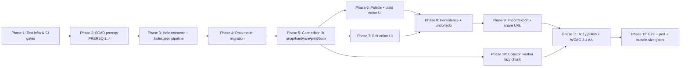

# Implementation Plan: Belt Editor

**Branch**: `feature/belt-editor` | **Date**: 2026-05-21 | **Spec**: [spec.md](./spec.md)
**Input**: [specs/belt-editor/spec.md](./spec.md), [interview-notes.md](./interview-notes.md)

---

## Summary

Add an interactive 2D editor for designing Kanix Modules (Mount + Attachments)
and Belts (Modules placed at angles around a belt strap). The editor lives
inside the existing Astro site, hydrates over the SSG-rendered loadout
detail pages, persists to localStorage, and supports file + URL bundle
export/import. A lazy-loaded Web Worker performs full 3D mesh-vs-mesh
collision detection using Three.js + `three-mesh-bvh` so saved configs
are physically buildable.

The implementation is layered: data-layer migration (modules.ts →
attachments.ts; new plates.ts, belt-clips.ts) → SCAD bolt-hole
extractor (BOSL2-anchored extraction at build time) → core editor
(palette + plate grid + belt canvas) → lazy collision worker →
import/export/share-URL → a11y polish → CI gates.

---

## Technical Context

**Language/Version**: TypeScript 5.x (target ES2022). Node 22 (per
`site/package.json` engines).
**Primary Dependencies**:
- **Astro 6** (already in `site/`) — SSG framework
- **Tailwind CSS 4** (already in `site/`) — styling
- **Three.js 0.172** (already in `site/`) — used today by
  STLViewer / BeltLayoutPanel; reused for the collision worker
- **three-mesh-bvh** (NEW) — fast mesh BVH for collision queries
- **Vitest** (NEW) — unit + integration test runner
- **Playwright 1.58** (already in `site/`) — e2e
- **axe-core / @axe-core/playwright** (NEW) — a11y scans
- **size-limit** (NEW) — bundle size CI gate
- **valibot** (NEW) — schema validation (smaller than Zod; tree-shakable)

**Storage**: Browser localStorage only (`kanix.modules.v1`,
`kanix.belts.v1`). No server state.
**Testing**: Vitest (unit + integration + SCAD round-trip);
Playwright (e2e via mcp-browser); axe-core (a11y); custom
SCAD-extractor round-trip via OpenSCAD subprocess.
**Target Platform**: Modern evergreen browsers (Chrome/Firefox/Safari
+ Mobile Safari + Chrome Android). Hard requirement: ES2020,
ResizeObserver, structuredClone, AbortController. No IE / legacy
support.
**Project Type**: SSG site with client islands (the existing site
pattern; this feature extends it).
**Performance Goals**:
- Editor hydrates <500ms on mid-range Android (SC-012)
- Drag input latency <16ms (60 fps)
- Collision check <5s per pair, async in worker (FR-285)
**Constraints**:
- Core editor bundle ≤80KB gzipped (SC-013)
- Collision lib bundle (lazy chunk) ≤250KB gzipped (SC-013)
- WCAG 2.1 AA (FR-750)
- Static HTML must remain functional with JS disabled (FR-650, FR-653)
**Scale/Scope**:
- ~25 attachments (current) → ~80 after planned additions
- ~5 bundled belt presets → ~20 user-saved configs typical
- localStorage budget per user: ≤500KB (well under 5MB browser quota)

---

## Constitution Check

Reviewed every plan decision against [.specify/memory/constitution.md](../../.specify/memory/constitution.md).

| Principle | Compliance | Notes |
|---|---|---|
| I. Nix-First Infrastructure | ✅ | All new tools (Vitest, axe-core, size-limit, three-mesh-bvh, valibot) installed via npm inside the existing `site/` package; the existing `site/flake.nix` already provides Node, OpenSCAD, Playwright. No new global installs. |
| II. Separation of Concerns | ✅ | Feature lives entirely under `site/` (the public-site domain). The SCAD anchor authoring touches `scad/` (3D-model domain). No cross-domain coupling. |
| III. Test-First, Nix-Native Testing | ✅ | Every FR has a corresponding test in Vitest, Playwright, or the SCAD round-trip. Real OpenSCAD subprocess used for round-trip (no mocked extractor). Negative tests for invalid placements, corrupted imports, etc. |
| IV. Specification-Driven Development | ✅ | This plan IS the SDD artifact. The data-model in `data-model.md` becomes the system of record for the new types. Code follows the spec; spec changes precede code changes. |
| V. State Machine Correctness | N/A | This feature has no persistent state machines (no orders, payments, etc.). The only state is in-memory editor state. |
| VI. Evidence-First Design | N/A | No purchases or audited actions in this feature. |
| VII. Inventory Atomicity | N/A | Editor produces lists; ordering is a Non-Goal. |
| VIII. Admin Safety and Auditability | N/A | No admin actions. |
| IX. Simplicity and Incremental Delivery | ✅ | Phased delivery: SCAD anchors → data model → palette → plate editor → belt editor → persistence → import/export → share URL → collision worker → a11y → CI gates. Each phase delivers a usable increment. No speculative abstractions. |

**No constitution violations.** Complexity Tracking table below is empty.

---

## Project Structure

### Documentation (this feature)

```text
specs/belt-editor/
├── spec.md              # Feature specification (Phase 2)
├── interview-notes.md   # Interview decisions + clarifications
├── plan.md              # This file (Phase 5)
├── research.md          # Architectural rationale + rejected alternatives
├── data-model.md        # Full type system + ERD-style diagrams
├── workflows.md         # Persona-driven E2E workflows (Phase 5.5)
└── tasks.md             # Task breakdown (Phase 6)
```

### Source Code (new + modified)

```text
site/                                  # Astro site (existing)
├── package.json                       # MODIFY: add vitest, axe-core, three-mesh-bvh, valibot, size-limit
├── astro.config.mjs                   # MODIFY: add Vitest integration if needed
├── vitest.config.ts                   # NEW
├── size-limit.json                    # NEW: bundle budgets
├── scripts/
│   ├── check-links.sh                 # existing
│   ├── test-checkout.sh               # existing
│   ├── verify-holes.sh                # NEW: CI gate per FR-203
│   └── scad-round-trip.sh             # NEW: SC-003 driver
├── src/
│   ├── data/
│   │   ├── attachments.ts             # NEW (was modules.ts)
│   │   ├── plates.ts                  # NEW (FR-154)
│   │   ├── belt-clips.ts              # NEW (FR-154)
│   │   ├── loadouts.ts                # MODIFIED: now emits Belt records
│   │   ├── kits.ts                    # existing — unchanged
│   │   └── products.ts                # existing — Attachment.products reuses Product
│   ├── lib/
│   │   ├── editor/
│   │   │   ├── types.ts               # NEW: all FR-100 series types
│   │   │   ├── snap.ts                # NEW: FR-250 snap math
│   │   │   ├── hardware-list.ts       # NEW: FR-702
│   │   │   ├── print-list.ts          # NEW: FR-700
│   │   │   ├── bom.ts                 # NEW: FR-701
│   │   │   ├── persistence.ts         # NEW: FR-500/501/503
│   │   │   ├── undo-redo.ts           # NEW: FR-800 series
│   │   │   ├── actions.ts             # NEW: action algebra
│   │   │   └── store.ts               # NEW: top-level editor state
│   │   ├── migrations/
│   │   │   ├── index.ts               # NEW: registered migration chain
│   │   │   ├── v0-to-v1.ts            # NEW (Loadout → Belt seeding)
│   │   │   └── ...                    # future versions
│   │   ├── share/
│   │   │   ├── encode.ts              # NEW: FR-601
│   │   │   └── decode.ts              # NEW: FR-604
│   │   └── collision/
│   │       ├── lazy-loader.ts         # NEW: dynamic import wrapper
│   │       └── worker.ts              # NEW: Web Worker (Three.js + three-mesh-bvh)
│   ├── components/
│   │   ├── BeltLayoutPanel.astro      # MODIFIED: now consumes Belt (was Loadout); hydrates editor
│   │   ├── STLViewer.astro            # existing — unchanged
│   │   ├── editor/
│   │   │   ├── EditorIsland.tsx       # NEW: top-level interactive island (Preact)
│   │   │   ├── Palette.tsx            # NEW: FR-300
│   │   │   ├── PlateEditor.tsx        # NEW: FR-350 series
│   │   │   ├── BeltEditor.tsx         # NEW: FR-400 series
│   │   │   ├── Gallery.tsx            # NEW: FR-330 series
│   │   │   ├── ImportExportDialog.tsx # NEW: FR-550 series
│   │   │   ├── ShareLinkDialog.tsx    # NEW: FR-600 series
│   │   │   ├── HardwareList.tsx       # NEW
│   │   │   └── ...
│   ├── pages/
│   │   ├── loadouts/
│   │   │   ├── [slug].astro           # MODIFIED: SSG + hydrated editor
│   │   │   ├── index.astro            # MODIFIED: gallery link
│   │   │   └── new.astro              # NEW: blank Belt entry
│   │   ├── belt-editor/
│   │   │   ├── index.astro            # NEW: gallery
│   │   │   └── new.astro              # NEW
│   │   └── modules/
│   │       └── [slug].astro           # MODIFIED: type rename (Module → Attachment)
│   └── pages/api/                     # N/A — no API endpoints in v1
└── test/
    ├── unit/
    │   ├── snap.test.ts
    │   ├── hardware-list.test.ts
    │   ├── migrations.test.ts
    │   ├── undo-redo.test.ts
    │   └── ...
    ├── integration/
    │   ├── editor-state.test.ts
    │   ├── persistence.test.ts
    │   ├── share-url-roundtrip.test.ts
    │   ├── scad-round-trip.test.ts    # SC-003
    │   └── collision-worker.test.ts   # SC-014
    └── e2e/
        ├── ssg-no-js.spec.ts          # SC-007
        ├── hydration-edit-save.spec.ts # SC-004
        ├── import-export.spec.ts      # SC-005
        ├── share-url.spec.ts          # SC-006
        ├── read-only-embed.spec.ts    # SC-008
        ├── a11y.spec.ts               # SC-009
        ├── undo-redo.spec.ts          # SC-010
        ├── migration.spec.ts          # SC-011
        └── perf-hydration.spec.ts     # SC-012

scad/                                  # SCAD models (existing — PREREQ work)
├── CLAUDE.md                          # existing — tracks Op 1 / Op 2 progress
├── lib/
│   ├── kanix-plate.scad               # PREREQ-1: rectangularize
│   ├── mounting-plate.scad            # PREREQ-3: add named anchors
│   ├── presets.scad                   # PREREQ-2: delete legacy aliases when migration done
│   ├── belt-clip.scad                 # PREREQ-3: add named anchors
│   └── ...                            # PREREQ-3: anchors on all accessory libs
├── plates/                            # PREREQ-1 unblocks the 6 stubbed fixtures
└── belt_clip_4x*_*.scad               # PREREQ-4: add if missing
```

**Structure Decision**: Layered single-project structure within the
existing `site/` Astro app. The editor is a sub-system of the site, not
a separate package — it shares the existing build, dev server, and
deployment with the marketing pages. Astro client islands (`client:load`
on `EditorIsland.tsx`) provide the hydration boundary; everything below
that boundary is pure TypeScript/Preact with no Astro coupling, making
it Vitest-testable.

---

## Architecture decisions (decision log; full rationale in `research.md`)

### UI framework for the editor island: **Preact** (with `signals`)

- **Decision**: Use Preact 10 (via `@astrojs/preact`) for the editor
  islands. Use `@preact/signals` for fine-grained reactivity.
- **Rationale**:
  - Smallest framework that gives us components + diffing (3KB gzipped).
  - First-class Astro integration (`client:load` works out of the box).
  - Signals model fits a editor (per-cell, per-placement reactivity)
    better than full React re-renders.
  - The site has no existing framework choice; Preact doesn't lock us
    into a heavier dependency later.
- **Alternatives rejected**:
  - **Vanilla TypeScript** — too much manual DOM management for a stateful
    drag-drop UI. Estimated 3x the code for the same UX.
  - **React** — 40KB+ baseline; would blow the 80KB editor budget alone.
  - **Solid** — comparable to Preact+signals but worse Astro integration
    and smaller community.
  - **Svelte** — runtime is small but Astro's Svelte integration adds
    Vite plugins we'd otherwise avoid.

### State management: **`@preact/signals` + a single `store.ts` class**

- **Decision**: Top-level state lives in a singleton class
  (`EditorStore`) that exposes signals. UI components subscribe via
  Preact signals; mutations go through the action algebra (FR-800).
- **Rationale**:
  - Signals avoid prop-drilling and over-rendering.
  - Singleton store fits the per-page editor model (one editor per
    loadout/belt-editor route).
  - Action algebra (each mutation is a pure
    `{ apply(state), invert(state) }` pair) gives undo/redo for free.
- **Alternatives rejected**: Zustand (adds React-ish API for no
  signals benefit), Redux (overkill), TanStack Store (heavier).

### Drag-drop library: **dnd-kit** (`@dnd-kit/core`)

- **Decision**: Use dnd-kit for desktop AND touch drag.
- **Rationale**:
  - First-class touch support with sensor configuration
    (long-press initiation, pointer events).
  - Keyboard-accessible out of the box (FR-304).
  - Tree-shakable; can stay within bundle budget.
  - Doesn't require global wrapper around the whole tree.
- **Alternatives rejected**:
  - **HTML5 native DnD** — broken on touch, terrible on mobile.
  - **react-dnd** — React-only, requires HTML5/Touch backend switching,
    less a11y-friendly.
  - **dragula** — old, no TS types, no touch sensor tuning.
  - **Custom pointer-event handler** — would re-implement dnd-kit
    poorly; would miss keyboard a11y and screen reader hooks.

### Schema validation: **valibot**

- **Decision**: Use valibot for ExportBundle schema validation on
  import + URL decode.
- **Rationale**:
  - 8x smaller than Zod (~1KB vs 8KB minified).
  - Tree-shakable per-schema.
  - Bundle budget is tight; every KB matters.
- **Alternatives rejected**:
  - **Zod** — beloved but too large for our budget.
  - **Hand-rolled validation** — error-prone, no migration support.
  - **JSON Schema + AJV** — heavy, ergonomics worse than valibot for
    schema authoring.

### SCAD bolt-hole extractor: **OpenSCAD CSG export + bash/jq**

- **Decision**: `scripts/extract-holes.sh` shells out to
  `openscad --export-format=csg` per model, parses the CSG output to
  find named anchor positions, emits `<model>.holes.json`.
- **Rationale**:
  - OpenSCAD's CSG export is the only programmatic way to read named
    BOSL2 anchors. Echo'd values appear in the CSG output.
  - Bash + jq keeps the build tooling lightweight; no new runtime.
  - Integrates trivially with the existing `npm run render` (which
    already shells out to OpenSCAD per fixture).
- **Alternatives rejected**:
  - **Python OpenSCAD parser** — would add Python to the build (Nix
    flake doesn't currently include it). Heavier than bash for this.
  - **Node-based parser** — pure Node STL parsers exist but BOSL2
    anchors don't survive STL export (they're geometric annotations,
    not mesh features).
  - **Embed anchors in TS by hand** — fast and fragile; will drift.
    Same option the user explicitly rejected in the interview.

### Collision worker: **Three.js (existing) + three-mesh-bvh**

- **Decision**: Web Worker imports a build-time chunk containing
  Three.js (already in the page's main bundle today — but wired in the
  worker context, three.js is also reused via Vite's import graph).
  three-mesh-bvh provides accelerated BVH queries.
- **Rationale**:
  - Three.js is already a dependency; reuse it.
  - three-mesh-bvh is the standard ~30KB extension; gives
    mesh-intersects-mesh in O(log n).
  - Web Worker keeps main thread responsive during drag-rotate-validate.
  - Bundle is naturally chunked because the worker is loaded via
    `new Worker(new URL('./worker.ts', import.meta.url))` — Vite/Astro
    handle the code-split automatically.
- **Alternatives rejected**:
  - **CANNON.js / Rapier** — physics engines, overkill for static
    intersection.
  - **2D silhouette overlap** — initial spec draft considered this;
    user explicitly chose full 3D in clarify round.
  - **No worker, main-thread Three.js** — would jank the UI during
    drag.

### Code-split bundle structure

- **Decision**: Three artifact bundles per loadout page:
  1. **SSG-rendered HTML/CSS** — no JS required (FR-650).
  2. **Core editor chunk** (`EditorIsland.tsx` + its deps): Preact +
     signals + dnd-kit + valibot + editor lib + static attachment
     metadata. Target ≤80KB gz.
  3. **Collision worker chunk** (`worker.ts` + Three.js + bvh):
     lazy-loaded on first Save / Validate. Target ≤250KB gz.

  Existing `BeltLayoutPanel.astro` already imports Three.js for STL
  rendering — that import is moved into a separate visualizer island
  (`BeltVisualizerIsland.tsx`) and made optional, so loadout pages that
  use only the editor don't pull Three.js until the visualizer or the
  collision worker is needed.

### Persistence layer

- **Decision**: `persistence.ts` exposes a typed `KV<T>` wrapper around
  `localStorage` with:
  - JSON serialization
  - Try/catch on every read (corrupted entries logged + skipped)
  - Try/catch on every write (quota errors surfaced as
    `StorageError` per the typed error hierarchy)
  - Optional `safeMode: true` flag that disables writes entirely (for
    SSR-safety in build environments where `localStorage` doesn't exist).
- **Rationale**: Pure utility; no library dependency. Browser
  `localStorage` is the spec.

### URL share encoding

- **Decision**: `gzip(JSON.stringify(...))` via `CompressionStream`
  ('gzip' algorithm) wrapped in `base64url`. CompressionStream is
  ES2022, supported in all target browsers. Avoids `pako` (40KB).
- **Rationale**: Native browser API; zero deps; small encoded payloads.
  Fallback: if the browser lacks CompressionStream, the share button is
  disabled with a tooltip (no polyfill to keep bundle small).

### Hydration directive

- **Decision**: `client:idle` for the editor island. Loadout pages
  hydrate when the browser is idle (typically <500ms post-load).
  `?config=` URL on load forces `client:load` so the shared config is
  visible immediately.
- **Rationale**: Balances hydration latency (SC-012) against bundle
  cost on slow connections.

---

## Phase Dependencies



**Parallelization**:
- P2 (SCAD ops) and P1 (test infra) can run in parallel.
- P6 (plate UI) and P7 (belt UI) can be done in parallel after P5.
- P10 (collision worker) can start any time after P3 (needs `.holes.json` to author test fixtures) and run independently of P6/P7/P8.

---

## Testing Strategy

### Test tiers

| Tier | Runner | Scope | Examples |
|---|---|---|---|
| **Unit** | Vitest | Pure functions; no DOM | snap.ts, hardware-list.ts, migration-chain, action algebra |
| **Integration** | Vitest + jsdom | Editor state + DOM interactions without browser | EditorStore + Palette interactions |
| **SCAD round-trip** | Vitest + OpenSCAD subprocess | Real OpenSCAD render → extract → snap math | SC-003 |
| **Collision** | Vitest + Three.js (jsdom + node canvas mock) | Worker collision logic | SC-014 |
| **E2E** | Playwright + mcp-browser | Full user flows on real Chromium | All P1 user stories |
| **A11y** | axe-core via Playwright | WCAG 2.1 AA conformance | SC-009 |
| **Bundle size** | size-limit | Gzipped chunk sizes | SC-013 |
| **Perf** | Playwright + CDP | Hydration latency on mid-range device profile | SC-012 |

### Test plan matrix (SC → test mapping)

| SC | Test tier | Fixture requirements | Assertion | Infrastructure |
|---|---|---|---|---|
| SC-001 | Vitest typecheck | None | `tsc --noEmit` exits 0 | CI |
| SC-002 | CI gate (verify-holes.sh) | All registered SCAD models | Every model has non-empty `.holes.json` | OpenSCAD in flake |
| SC-003 | Vitest + OpenSCAD subprocess | Every Attachment SCAD + reference rotation | Editor snap math matches OpenSCAD-rendered placement ±0.5mm | OpenSCAD in flake |
| SC-004 | Playwright e2e | Every bundled preset + 1 user storage state | preset → edit → save → reload restores | mcp-browser |
| SC-005 | Playwright e2e | Saved 2 Modules + 1 Belt | Export → import restores deep-equal | mcp-browser |
| SC-006 | Playwright e2e | Small Belt config + fresh browser context | URL round-trip restores Belt | mcp-browser |
| SC-007 | Playwright (JS disabled) + curl | Every bundled preset | HTML contains belt visual + lists | CI |
| SC-008 | Playwright + network requests | Test embed page | No editor JS bundle fetched | mcp-browser |
| SC-009 | axe-core via Playwright | Editor active for every route | 0 serious + 0 critical violations | mcp-browser + axe-core |
| SC-010 | Vitest unit | Random action sequence (seeded) | Undo+redo produces same final state as direct apply | None |
| SC-011 | Vitest integration | Every legacy Loadout entry | Migration produces equivalent Belt | None |
| SC-012 | Playwright + CDP | Mid-range Android emulation, largest preset | Hydration <500ms | mcp-browser |
| SC-013 | size-limit | Built editor chunk + collision chunk | Core ≤80KB; collision ≤250KB | CI |
| SC-014 | Vitest + Three.js | SCAD-overlapping pair + non-overlapping pair | Collision worker reports correctly | OpenSCAD + node-canvas mock |

### Test fixtures

- **Preset snapshots**: serialized JSON of every bundled Belt + Module
  set, generated by a script during `npm run build`. E2E tests load
  these as known-good baselines.
- **SCAD overlap pair**: `test/fixtures/overlap.scad` and
  `test/fixtures/no-overlap.scad` — minimal hand-authored SCAD files
  that produce intentionally overlapping / non-overlapping geometry
  for SC-014.
- **Legacy loadout snapshot**: a frozen copy of `loadouts.md` as it
  exists pre-migration, used to drive the migration test (SC-011).

### Concurrency / async

- Web Worker collision is the only async subsystem. Worker tests run
  with the worker spawned via `new Worker()` in jsdom (jsdom supports
  workers as of v22+), or via a node-worker shim that imports the
  same `worker.ts` module.

### Adversarial inputs

- **Tampered share URL** — bit-flipped base64 → expect "corrupted link"
  banner, no crash.
- **Truncated import JSON** — half-written file → per-entry error,
  rest of bundle imports.
- **Huge import (>256KB after decompression)** → refused with error
  banner (FR security note).
- **Cross-origin attempt to read localStorage** — N/A (same-origin
  only).
- **XSS via attachment name in import** → Astro/Preact escape all
  user-supplied strings by default; test that `<script>` payloads
  render as text.

### Pre-PR gate

`make pre-pr` (or `npm run pre-pr` if no Make) runs in order:
1. `npm run typecheck` (tsc --noEmit)
2. `npm run lint` (existing eslint/prettier)
3. `npm run test` (Vitest unit + integration)
4. `npm run test:scad-round-trip` (SC-003 — slowest part of test suite)
5. `bash scripts/verify-holes.sh` (SC-002)
6. `npm run build` (Astro build, embeds extracted holes)
7. `npm run test:e2e` (Playwright — slowest gate; SC-004/5/6/7/8/9/10/11/12)
8. `npm run size-check` (size-limit; SC-013)

CI runs the same suite; agents check `summary.json` after each phase.

---

## Internal interface contracts

| IC | Name | Producer | Consumer(s) | Specification |
|---|---|---|---|---|
| IC-001 | `<model>.holes.json` format | `scripts/extract-holes.sh` (Phase 3) | `attachments.ts` / `plates.ts` / `belt-clips.ts` build step (Phase 4) | One JSON file per `.scad` model. Schema: `{ "model": "<filename>", "anchors": [ { "name": string, "x": number, "y": number, "z": number, "normal": [number, number, number], "boltSize": string } ] }`. Coordinates in mm relative to the model's local origin. `boltSize` follows the M-prefix convention (`"M3"`, `"M5"`). Unknown bolt size: `"unknown"` (warns at build time per FR-702 default-table fallback). |
| IC-002 | localStorage key format | `persistence.ts` (Phase 8) | Future site versions | Keys: `kanix.modules.v<N>`, `kanix.belts.v<N>` where `<N>` is the schema major version. Value: JSON-serialized `Module[]` or `Belt[]`. On version bump, the migration chain reads old key + writes new key + deletes old. |
| IC-003 | Worker message protocol | `lazy-loader.ts` (main thread) | `worker.ts` (worker) | Postable messages: `{ type: "check", id: string, pairs: Array<{ a: MeshSpec, b: MeshSpec }> }` → `{ type: "result", id: string, collisions: Array<{ a: string, b: string, bbox: [...] }>, indeterminate: string[] }`. `MeshSpec`: `{ id: string, stlUrl: string, transform: { translation: [3], rotation: [3] } }`. Worker fetches STLs on demand, caches by `stlUrl`. |
| IC-004 | `ExportBundle` wire format | `share/encode.ts` + `ImportExportDialog` | `share/decode.ts` + import flow | JSON shape per FR-110. Encoded for URL: `base64url(gzip(JSON.stringify(bundle)))`. File export: raw JSON, content-type `application/json`, suggested filename `kanix-belt-<slug>-<date>.json`. |

---

## Critical path (user perspective)

The day-1 user flow that proves the editor works end-to-end:

1. User visits `/loadouts/trainer/` (or any preset).
2. Static SSG belt map renders immediately (≤500ms TTFB).
3. Editor hydrates over the map (`client:idle`, ≤500ms more per SC-012).
4. User drags an attachment from the palette onto a plate.
5. Snap math (FR-250) validates ≥2-bolt alignment; aligned holes turn green.
6. User clicks Save; the Module + Belt persist to localStorage.
7. Hardware list updates with bolt count.
8. User reloads the page; the edited state is restored from localStorage.

**Phase mapping**:
- Phase 1-3 → step 0 (CI infrastructure)
- Phase 4 → step 1 (SSG data model)
- Phase 5+6 → steps 4, 5 (snap math + palette/plate UI)
- Phase 7 → step 1, 6 (belt visualization)
- Phase 8 → steps 6, 7, 8 (persistence + undo/redo)
- Phase 10 → step 5 expansion (collision validation)

**Incremental integration checkpoints**:
- After Phase 4: legacy loadouts.md → Belt migration produces same
  visible content (E2E test on every preset page).
- After Phase 6: drag attachment, see snap state.
- After Phase 8: edit + save + reload restores.
- After Phase 9: export bundle, fresh browser, import restores.
- After Phase 10: physically-overlapping placement gets blocked.

---

## Pre-implementation prerequisites

Per the spec's PREREQ section, before this feature's implementation
PR can land:

- **PREREQ-1 (SCAD Op 1)**: `kanix_plate` rectangularized; 6 stubbed
  plate fixtures render full clips. Acceptance: every editor-supported
  plate STL is a real clip, not a stub.
- **PREREQ-2 (SCAD Op 2)**: All accessory fixtures migrated from
  `kanix_preset_*` to `kanix_grid_*`. Acceptance:
  `grep -l kanix_preset_ scad/` returns empty; legacy aliases deleted.
- **PREREQ-3 (BOSL2 anchors)**: Named anchors on every bolt hole in
  every editor-supported SCAD module. Acceptance: extractor produces a
  non-empty `HoleSpec[]` for every registered model.
- **PREREQ-4 (BeltClip 4xN)**: New SCAD fixtures `belt_clip_4x2_*.scad`
  and `belt_clip_4x3_*.scad` if missing. Acceptance: registered in
  `belt-clips.ts` and produces valid `.holes.json`.

These prereqs are tracked as Phase 2 tasks in `tasks.md` (Phase 6
output) since they're on the critical path.

---

## Complexity Tracking

> No constitution violations identified during planning. Table left
> empty intentionally.

| Violation | Why Needed | Simpler Alternative Rejected Because |
|---|---|---|
| _(none)_ | _(none)_ | _(none)_ |

---

## Post-implementation validation strategy

- **Build and install command**: `cd site && npm run build` produces a
  static `dist/` consumable by the existing Cloudflare-Pages / Pages
  deployment. No new install step beyond `npm install`.
- **Primary user flows for the smoke test agent**:
  - Visit `/loadouts/trainer/` JS-disabled → static belt visible.
  - Visit `/loadouts/trainer/` JS-enabled → editor hydrates, drag
    attachment, save, reload → state restored.
  - Visit `/belt-editor/` → gallery lists presets + saved configs.
  - Create New Module from gallery → save → appears in library.
  - Export bundle → clear localStorage → import → state restored.
  - Generate share URL → open in fresh context → state restored.
- **CI/CD pipeline access**: GitHub Actions workflow at
  `.github/workflows/test.yml` (existing) gains the new gates
  (`verify-holes`, `scad-round-trip`, `bundle-size`, `axe-a11y`).
  Agents use `gh` CLI to monitor and fix failures.
